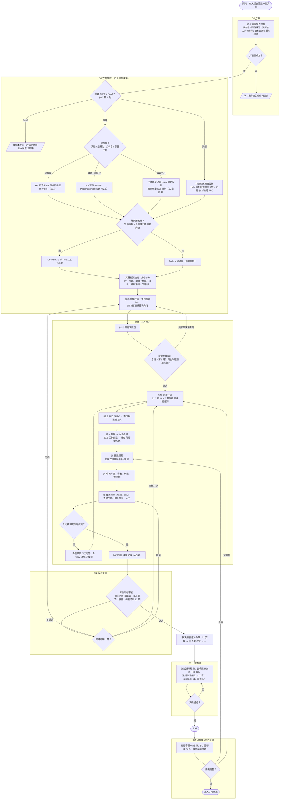

# 00b - 設計階段的需求考量

本章放在安裝之前。§0 先處理「該不該自己建、往哪個方向建」的前置條件與框架決策；之後才在碰任何安裝媒體之前，把「這台（或這群）主機要解決什麼問題、要撐多久、壞了會怎樣、誰來維運」問清楚，再由這些答案**推導**後面各章的選項——發行版、分割區、HA 等級、備份策略、安全強化深度、監控範圍。本章是方法論，不需要實驗機驗證；容量估算的範例數字標明來源（實驗機實測或典型值）。

**本章解決什麼問題**：手冊後面每一章都提供多種做法（ext4 還是 XFS？要不要 LVM thin？Keepalived 還是 Pacemaker？每日備份還是 PITR？），沒有需求就無從選擇，最常見的結果是「照範例裝、上線後才發現 RPO 不夠 / 磁碟規劃錯 / 合規過不了」——而其中分割區、檔案系統、發行版這三項在上線後幾乎無法改，只能重裝。花一小時做設計，省掉的是一次重裝加一次資料搬遷。

**名詞與關係**：

| 名詞 | 一句話定義 | 與其他名詞的關係 |
|---|---|---|
| **需求（requirement）** | 系統必須滿足的條件，分功能性（做什麼）與非功能性（多快、多可靠、多安全） | 本章只處理非功能性需求；它們決定架構與設定，功能需求決定裝哪些應用 |
| **工作負載（workload）** | 主機實際跑的東西的型態：web / API、資料庫、檔案服務、批次、容器平台、桌面 | 決定 CPU / 記憶體 / I/O 的比例、檔案系統選擇、調校方向（09 章） |
| **可用性等級（Tier）** | 依「停機造成的損失」把系統分級，每級對應允許的年停機時數與必要的冗餘 | 決定 HA 設計深度（10 章）與維護窗口；Tier 越高成本呈倍數成長 |
| **RPO / RTO** | 可接受的資料遺失時間 / 可接受的復原時間 | 決定備份頻率、複製方式、演練頻率（11 章）；與 Tier 一起構成「可靠性需求」 |
| **合規（compliance）** | 外部規範（PCI-DSS、ISO 27001、個資法、CIS 基準）對設定與紀錄的強制要求 | 決定安全強化深度、稽核與日誌保留（07、08 章）；不可協商的需求 |
| **容量規劃（capacity planning）** | 估算 CPU、記憶體、儲存、網路在生命週期內的需求並預留成長 | 決定硬體 / VM 規格與分割區大小（01、06 章）；估錯儲存最難補救 |
| **生命週期（lifecycle）** | 系統從上線到退役的預計時間，以及期間的升級節奏 | 直接決定發行版（LTS vs Fedora）與升級策略（03 章 §9） |
| **維運模型（operating model）** | 誰維運、幾人、幾點可以動、變更要不要審、有沒有 on-call | 決定自動化程度、監控告警設計、文件要求（12、13 章） |
| **設計決策紀錄（ADR）** | 一頁式文件：需求 → 選項 → 決定 → 理由 → 對應章節 | 本章的產出；上線後排障與交接時的第一份文件 |
| **環境（environment）** | dev / staging / prod 等隔離的部署層級 | 決定要幾套、差異在哪、如何避免測試影響正式 |

---

## 0. 設計前的決策條件與考量重點

**名詞與關係**：

| 名詞 | 一句話定義 | 與其他名詞的關係 |
|---|---|---|
| **前置條件（precondition）** | 開始設計之前必須成立的事實：有擁有者、有預算、有時程、問題陳述清楚、資料分級已知 | 任一不成立就不該進入 §1 的需求蒐集；缺的通常是「誰負責」與「錢從哪來」 |
| **框架決策（framing decision）** | 決定整個設計空間的方向性選擇：自建或託管、實體或雲端、集中或分散、哪個發行版家族 | 在需求細節之前就要定，因為它決定後面哪些選項根本不存在（雲端沒有 VRRP、SaaS 不需要本章大半內容） |
| **單向門 / 雙向門（one-way / two-way door）** | 不可逆（改要重裝或搬資料）vs 可逆（換掉成本低）的決策 | 單向門值得花時間評估與審查；雙向門用預設值快速決定、之後再改 |
| **TCO（總擁有成本）** | 生命週期內硬體 + 授權 + 人力 + 停機損失 + 退場成本的總和 | 比較選項時的共同尺度；只看採購價會低估自建的人力與停機成本 |
| **鎖定（lock-in）與退出策略** | 換供應商 / 換平台的難度，以及事先規劃好的搬遷路徑 | 影響託管與商用元件的選擇；有退出策略的鎖定是可以接受的取捨 |
| **加權評分（decision matrix）** | 列出評估準則、給權重、對每個選項打分後加總 | 把「感覺」變成可審查、可回溯的決策紀錄 |
| **決策關卡（gate）** | 階段之間的審查點，通過才進下一階段 | 把「發現設計錯誤」的時間點提前到最便宜的階段 |

**為什麼**：§1 開始的需求分析假設你已經決定「要自己在 Linux 上建這個系統」；但很多失敗的專案問題出在更前面——沒有人擁有它、預算只夠買機器不夠請人維運、其實買 SaaS 就好、或選了公有雲卻照機房的方式設計。這些框架決策一旦做錯，後面再精細的需求分析都是在錯的方向上優化。本節的目的是在花任何時間設計之前，先用最少的資訊排除掉錯誤的方向。

**怎麼做**：

### 0.0 設計決策流程總覽

**為什麼**：§0～§6 的內容是線性寫的，但實際決策有分支與迴圈——前置條件不成立要退回、選 SaaS 就整份手冊不用看、雲端與機房走不同的 HA 路線、審查不過要回到容量或 HA 重算。一張圖可以看清楚「現在在哪一步、下一步看哪一節、什麼情況要回頭」。

**怎麼做**：依圖走；菱形是要回答的問題，方框標示對應小節，粗線框是關卡（G0～G4）。



純文字版（不支援 Mermaid 的閱讀器）：

```
開始
 │
 ▼
[G0 立項] §0.1 前置條件六項 ──否──▶ 停，補齊再回來
 │ 是
 ▼
[G1 方向] 自建 / 託管 / SaaS？ ──SaaS──▶ 離開本手冊（評估供應商 SLA、退出策略）
 │ 自建（託管：只保留應用層，仍驗證 RPO）
 ▼
 建在哪？ ─ 公有雲 ──▶ HA 走雲端 LB / 多可用區（無 VRRP）
          ─ 實體 / 虛擬化 ──▶ HA 可用 VRRP / Pacemaker / DRBD
          ─ 容器平台 ──▶ 節點仍需 Linux 設計，應用層走 K8s
 ▼
 生命週期 > 3 年或不能頻繁升級？ ─是─▶ Ubuntu LTS / RHEL 系 ；─否─▶ 可考慮 Fedora
 ▼
 其餘框架決策 → §0.3 加權評分 → §0.4 標記單向門
 │
 ▼
[設計] §1 十題 → 硬限制（合規、生命週期）與框架決策衝突？ ─是─▶ 回 §0.3
 │ 否
 ▼
 §2.1 Tier ＋ §2.7 SLA 計算 → §2.2 RPO/RTO → §2.4 合規基線 ＋ §2.5 工作負載
 → §3 容量（含隱性用量、預留 20%）→ §4 環境 / 網段 → §5 維運模型
 → 人力撐得起？ ─否─▶ 降複雜度（託管 / 降 Tier / 保守技術）回 §2.1
 │ 是
 ▼
[G2 審查] §6 ADR → 非設計者審查（單向門、SLA、容量、12 項清單）
 ├─ 不通過：方向→§0.3 ／ 容量或 HA→§2.1 ／ 維運→§5
 └─ 通過
     ▼
 依決策表進入 01 安裝 → 02 初始設定 → …
     ▼
[G3 上線準備] 測試環境、備份還原測試、監控告警、runbook → 演練不過就重來
     ▼
 上線
     ▼
[G4 30 天檢討] 實際容量 vs 估算、SLI vs SLO、事故
 ├─ 容量偏差 → 回 §3 ／ 可靠性不足 → 回 §2.1
 └─ 進入日常維運
```

**注意**：圖中三個回頭的箭頭（硬限制衝突、人力不足、審查不過）是本章最有價值的部分——它們發生在紙上，成本是幾小時；同樣的發現若在上線後，就是 §0.4 單向門清單裡的代價。

### 0.1 前置條件：五個「沒有就先停」

| 條件 | 檢查方式 | 不成立的後果 |
|---|---|---|
| **有明確的擁有者** | 能說出一個人名負責業務決策、一個人名負責技術維運 | 沒有人會回答 §1 的問題，上線後沒人處理告警 |
| **問題陳述一句話寫得出來** | 「為了 __ 使用者，解決 __，現況是 __」 | 需求會無限膨脹；無法判斷任何選項好壞 |
| **預算含人力與生命週期** | 不只採購價：維運人月、授權 / 訂閱、備份儲存、演練時間 | 只買得起硬體的專案會變成無人維運的孤兒 |
| **時程與里程碑** | 上線日、之前必須完成的採購 / 網路 / 帳號申請 lead time | 為了趕時程跳過設計與測試 |
| **資料分級與法規已知** | 資料屬於哪一級（公開 / 內部 / 機密 / 個資）、適用哪些法規 | 合規是硬限制，事後補做（加密、稽核、留存）成本最高 |
| **既有標準與限制** | 公司指定的發行版、身分系統（AD / SSO）、監控平台、機房 / 雲端合約、網段政策 | 設計出的系統無法接入既有環境 |

### 0.2 框架決策：先定方向

**名詞與關係**：下表的九組選項是互相獨立的維度，但前三組（誰來建、建在哪、建幾台）會限制後面能選什麼——例如選了 SaaS 就不必再談發行版與租戶隔離，選了公有雲就會影響 HA 機制（§2.6）與資料落地。

| 名詞 | 一句話定義 | 與其他名詞的關係 |
|---|---|---|
| **自建（self-hosted）** | 在自己控制的 Linux 主機上安裝並維運整個系統 | 本手冊其餘章節都以自建為前提；責任（可用性、備份、安全）全在自己 |
| **託管（managed service）** | 雲端或供應商代管基礎設施層（如 RDS、託管 Kubernetes），你只管應用與資料 | 介於自建與 SaaS 之間；HA 與備份由供應商提供但仍要設定；仍可能需要 Linux 知識（VM 內） |
| **SaaS** | 整個應用由供應商營運，你只使用（GitLab.com、Google Workspace） | 完全不需要本手冊的內容；代價是資料在對方手上與鎖定 |
| **實體機（bare metal）** | 作業系統直接裝在硬體上 | 效能與硬體存取最完整；HA 靠 VRRP / Pacemaker + fencing；容量固定 |
| **虛擬化（KVM / VMware / Proxmox）** | 一台實體機切成多台 VM，由 hypervisor 管理 | 提供快照、遷移、hypervisor 層 HA；13 章 §4 的 KVM；VM 內仍是完整 Linux |
| **公有雲（IaaS）** | 向雲端租用 VM、儲存、網路，按用量計費 | 沒有 VRRP、有雲端 LB 與託管服務；成本從固定變浮動；cloud-init 為標準入口（13 章 §2） |
| **容器平台（Kubernetes 等）** | 以容器為部署單位、由編排器排程與自癒的平台 | 平台本身跑在實體機 / VM / 雲端之上，仍需要 Linux 節點維運；適合微服務與多團隊 |
| **集中（consolidation）** | 少數大機器承載多個服務 | 維運簡單、爆炸半徑大；用 cgroup / 容器隔離（09 章 §8） |
| **分散（distribution）** | 多台小機器各司其職 | 故障域隔離、可水平擴充；需要自動化（13 章 §1）與集中式日誌 / 監控 |
| **Debian 系** | 以 Debian 為上游的發行版家族（Ubuntu 等），apt / .deb、AppArmor | 00 章的 🟠 這一側；與 RHEL 系工具鏈互不相容 |
| **RHEL 系** | 以 Fedora → RHEL 為主軸的家族（RHEL、Rocky、Alma、Fedora），dnf / .rpm、SELinux | 00 章的 🔵 這一側；企業軟體認證多以 RHEL 為準 |
| **社群版** | 由社群維護、無付費支援的發行版或版本（Ubuntu 非 Pro、Fedora、Rocky / Alma） | 安全更新仍有，但沒有人可以打電話、沒有延長支援與 Livepatch |
| **商業支援** | 付費取得供應商支援、延長生命週期與合規工具（Ubuntu Pro、RHEL 訂閱） | 常是保險 / 稽核的要求；08 章 §1.2 的 ESM / Livepatch / USG 屬此 |
| **開源元件** | 原始碼公開、授權允許自由使用的軟體（PostgreSQL、HAProxy、restic） | 本手冊的主要選擇；風險是授權變更與維護者流失 |
| **商用元件** | 需付費授權的軟體（商用 DB、備份套件、LB 設備） | 換取 SLA 與功能；需評估鎖定與退出策略 |
| **單一租戶** | 一套系統只服務一個客戶 / 團隊 | 隔離最強、成本最高；合規常要求 |
| **多租戶（共用）** | 一套系統服務多個客戶 / 團隊，靠帳號、cgroup、容器或命名空間隔離 | 成本低；需處理吵鄰居與隔離失效風險（09 章 §8、16 章 §7） |
| **資料落地（data residency）** | 法規或合約要求資料只能存放在特定國家 / 區域 | 限制雲端區域與 SaaS 選擇；跨區 DR 需確認合規（10 章 §7.3） |
| **分階段（phased）建置** | 先建最小可用版本驗證，再依實際負載升級設計 | 降低單向門決策的風險；與 Tier 3 → Tier 2 的演進對應（§2.1） |

每個決策列出「選左邊的條件」與「選右邊的條件」；條件同時成立時用 §0.3 的加權評分。

| 決策 | 選 A 的條件 | 選 B 的條件 | 考量重點 |
|---|---|---|---|
| **自建（Linux 上自己架）vs 託管 / SaaS** | A：資料不能出境或不能交給第三方、需要深度客製、規模大到自建較便宜、團隊有能力 | B：功能是標準品（郵件、Git、監控、DB）、團隊 < 3 人、需要快速上線、可用性要求高但沒有 on-call | TCO（含人力）、退出策略、資料主權、可用性責任在誰 |
| **實體機 vs 虛擬化（KVM / VMware / Proxmox）vs 公有雲 vs 容器平台** | 實體：極端 I/O / GPU / 授權綁硬體；虛擬化：自有機房、要整合多台、需要快照與遷移；雲端：彈性擴縮、全球部署、不想管硬體 | 容器平台（Kubernetes）：微服務、多團隊、需要標準化部署且有人維運平台 | 各自能用的 HA 機制不同（§2.6）；雲端的變動成本 vs 機房的固定成本；平台本身也要維運 |
| **集中（少數大機器）vs 分散（多台小機器）** | 集中：單一應用、垂直擴充足夠、維運人力少 | 分散：需要水平擴充、故障域隔離、不同服務不同生命週期 | 爆炸半徑、升級與維護窗口、授權計價方式（按核心 vs 按台） |
| **Debian 系（Ubuntu）vs RHEL 系（Fedora → RHEL / Rocky / Alma）** | Ubuntu：長期支援、雲端與社群資源、團隊熟 apt、需要 ZFS | RHEL 系：企業軟體只認證 RHEL、需要 SELinux / STIG 合規、未來要買 Red Hat 支援、團隊熟 dnf | 00 章差異表；混用兩家族會讓自動化與知識翻倍，**組織內盡量單一家族** |
| **社群版 vs 商業支援（Ubuntu Pro / RHEL 訂閱）** | 社群：非關鍵、有能力自行處理安全與升級 | 商業：合規要求有支援合約、需要 10 年生命週期、Livepatch、有人可以打電話 | 訂閱費 vs 一次事故的損失；支援合約通常也是保險與稽核的要求 |
| **開源元件 vs 商用元件**（DB、備份、監控、LB） | 開源：功能足夠、社群活躍、團隊能維護、避免鎖定 | 商用：需要 SLA、功能是差異化關鍵、開源替代品成熟度不足 | 授權模式變更風險（近年多起開源改授權）、退出策略、隱藏的支援成本 |
| **單一租戶 vs 多租戶共用** | 單一：合規要求隔離、客戶等級差異大、資源需求可預測 | 共用：成本壓力、租戶行為相似、有能力做 cgroup / 容器 / 命名空間隔離 | 隔離失效的後果、吵鄰居問題（09 章 cgroup）、按租戶計費與監控 |
| **地區與資料落地** | 單一區域：法規要求資料不出境、延遲敏感、成本 | 多區域：使用者分散全球、需要站點級 DR | 跨區複製的頻寬與一致性（10 章）、法規（GDPR 等）、時區與維護窗口 |
| **現在建 vs 延後 / 分階段** | 現在：需求明確且穩定、依賴已就緒 | 分階段：需求未定、先用最小版本驗證、依賴（網路、帳號、採購）未到位 | 先建 Tier 3 單機驗證，再依實際負載升級到 Tier 2 的設計，比一開始就建 HA 便宜且準確 |

**注意**：這些決策大多是**單向門**——自建轉託管要搬資料、機房轉雲端要重做網路與 HA、換發行版家族要重寫自動化。§0.4 列出完整的單向門清單。

### 0.3 考量重點與加權評分

**為什麼**：框架決策通常同時牽涉成本、風險、技能、合規，不同利害關係人看重的不同；不把準則與權重寫下來，會議結論只會是「聲音最大的人贏」，三個月後也沒人記得為什麼。

**怎麼做**：對每個框架決策建立一張評分表（放進設計紀錄）。常用準則與典型權重：

| 準則 | 問的問題 | 典型權重 | 備註 |
|---|---|---|---|
| 生命週期總成本（TCO） | 5 年內硬體 + 授權 + 人力 + 停機損失 + 退場 | 25% | 人力用「人月 × 月薪」計，不要漏 |
| 可逆性 / 退出成本 | 錯了要多久、多少錢才能改？ | 15% | 單向門的權重提高 |
| 技能與維運負擔 | 現有團隊會不會？要不要 on-call？ | 20% | 需要新技能的選項要加上學習期與招募風險 |
| 風險與可用性 | 最壞情況的損失？誰負責復原？ | 15% | 託管的責任在對方，但 SLA 賠償通常遠小於損失 |
| 合規與安全 | 是否滿足硬限制？額外要做什麼？ | 硬限制不打分：不合規直接淘汰 | |
| 時程 | 能否在期限內上線？ | 10% | 採購 / 合約 lead time 常被低估 |
| 鎖定 | 供應商 / 技術綁定程度 | 10% | 有明確退出策略可降低扣分 |
| 與既有環境整合 | 接得上 SSO、監控、備份、網段嗎？ | 5% | 接不上就是隱藏的自建成本 |

```
評分範例：內部 Git 服務 —— 自建 GitLab（Ubuntu VM） vs GitLab SaaS
準則（權重）        自建   SaaS
TCO 5 年（25%）      3      4     ← 自建含 0.3 人月/月維運
可逆性（15%）        4      3     ← SaaS 匯出資料可行但 CI 設定需重做
技能負擔（20%）      2      5
風險（15%）          3      4
時程（10%）          2      5
鎖定（10%）          4      2
整合（5%）           4      3
加權總分             3.05   3.95  → SaaS；但若資料不可出境（硬限制），自建為唯一選項
```

**注意**：評分表的價值在於「準則與權重被寫下並被審查」，不在小數點；總分接近時（差 < 0.5）以可逆性高的選項優先。

### 0.4 單向門清單：這些決策值得慢

| 決策 | 為什麼不可逆 | 改變的代價 | 章節 |
|---|---|---|---|
| 發行版家族 | 套件、自動化、政策工具全部不同 | 重裝 + 重寫 playbook + 重新驗證 | 00 |
| 分割區配置與檔案系統 | XFS 不能縮、ext4 ↔ XFS 需重建、根目錄搬 LVM 需重裝 | 停機重做 + 資料搬遷 | 01 §2、06 |
| 是否全碟加密 | 事後加密需重寫整顆碟 | 重裝或離線轉換 | 06 §6 |
| 網段與 IP 編址 | 所有防火牆規則、DNS、憑證、應用設定都引用它 | 全面重新編址 | 05、§4 |
| 資料庫引擎與版本 | 應用 SQL、複製架構、備份工具綁定 | 應用改寫 + 資料轉換 | 10 §6、11 §7 |
| 身分來源（本機 / LDAP / AD / SSO） | UID/GID 對應、檔案擁有者、sudo 規則 | 重新對應所有檔案與權限 | 02 §3 |
| 機房 / 雲端 / 區域 | HA 機制、網路、合約、資料落地 | 整體搬遷 | §2.6 |
| 主機名與網域命名規則 | 憑證、日誌、監控、自動化都引用 | 全面更名 | 02 §1 |

雙向門（用預設值快速決定即可）：監控工具、備份工具（資料格式可轉換時）、日誌收集方案、防火牆前端、編輯器與 shell 設定、Cockpit 之類的管理介面、HA 的 LB 軟體（HAProxy ↔ Nginx）。

### 0.5 決策關卡

**為什麼**：設計錯誤在紙上改要 1 小時、在測試機改要 1 天、在正式機改要 1 週加一次停機。關卡就是強迫在便宜的階段檢查。

| 關卡 | 進入條件 | 產出 | 審查人 |
|---|---|---|---|
| G0 立項 | §0.1 五個前置條件成立 | 一頁問題陳述 + 預算 + 擁有者 | 業務 + 技術主管 |
| G1 方向確認 | §0.2 框架決策完成、§0.3 評分表 | 設計紀錄第 1～2 節 | 技術主管 + 資安（合規硬限制） |
| G2 設計審查 | §1～§5 完成、容量估算、單向門逐項確認 | 完整設計紀錄 + 上線前檢查清單（§6） | 另一位工程師（非設計者）+ 維運 |
| G3 上線準備 | 測試環境驗證、備份還原測試、runbook、監控告警已接 | 演練紀錄 | 維運 + 業務擁有者 |
| G4 上線後檢討 | 上線 30 天 | 實際容量 vs 估算、事故、待改項 | 全體 |

### 0.6 常見的錯誤決策模式

| 模式 | 為什麼會發生 | 後果 | 對策 |
|---|---|---|---|
| 「先裝再說」 | 安裝很快、設計看起來是拖延 | 分割區與檔案系統錯 → 重裝 | 單向門清單過一遍再裝（30 分鐘） |
| 按最高規格設計 | 怕不夠、沒有量化損失 | 成本 3 倍的 Tier 1 撐一個 Tier 3 系統，且沒人維運複雜的 HA | §2.1 先量化停機損失 |
| 照著上一個專案抄 | 省事 | 需求不同（合規、規模、位置）卻用相同設計 | 每個專案重填 §1 十題，只需一小時 |
| 只算採購價 | 人力與停機不在採購單上 | 自建看起來便宜，上線後無人維運 | TCO 含人月與停機損失 |
| 選最新技術 | 有趣、履歷 | 團隊不熟、社群小、出事沒人救 | 技能負擔權重 20%；正式環境用團隊會的 |
| 決策沒有紀錄 | 覺得大家都記得 | 後人「修正」正確決策、交接失敗 | §6 的 ADR，每個單向門一條 |
| 忽略退出策略 | 選的時候沒想過會換 | 授權變更 / 供應商倒閉時被綁住 | 每個託管與商用元件寫下「怎麼搬走」 |
| 合規最後才看 | 資安 / 法務不在早期會議 | 上線前才發現要加密、要留存日誌一年 | G1 就找資安確認硬限制 |

---

## 1. 需求蒐集：先問十個問題

**為什麼**：沒有這十個答案，後面所有「該選哪個」都只能憑感覺。這些問題的答案通常不在技術人員手上（業務、法務、財務），所以要**在開工前**問，而不是在安裝程式的分割畫面前猜。

**怎麼做**：逐項填入 [`scripts/examples/design-record.md`](scripts/examples/design-record.md) 範本。

| # | 問題 | 為什麼重要 | 影響的章節 |
|---|---|---|---|
| 1 | **跑什麼工作負載**？（web / API、DB、檔案、批次、容器、桌面、混合） | 決定資源比例與檔案系統：DB 要低延遲 I/O 與大記憶體、檔案服務要大容量與快照、批次要 CPU 與可中斷 | 01、06、09 |
| 2 | **多少使用者 / 流量 / 資料**，一年後成長多少？ | 容量規劃的輸入；資料成長率決定分割區與 LVM 預留 | §3、01、06 |
| 3 | **停機一小時損失什麼**？可接受一年停幾小時？ | 決定 Tier → HA 深度；大多數內部系統其實是 Tier 3，不需要 Pacemaker | §2、10 |
| 4 | **資料遺失多久可以接受**（RPO）？**多久內要恢復**（RTO）？ | 決定備份頻率、是否需要複製、是否需要熱備機 | §2、11 |
| 5 | **有哪些合規或稽核要求**？ | 決定 MAC enforcing、auditd 規則、日誌保留年限、加密、密碼政策——這些事後補做成本極高 | 07、08、16 |
| 6 | **要撐幾年**？期間能不能停機做大版本升級？ | Ubuntu LTS 5～12 年 vs Fedora 13 個月；不能停機升級就必須是 LTS 或 RHEL 系 | 00、03 §9 |
| 7 | **誰維運、幾個人、技術背景**？ | 一人維運選保守技術（ext4 + LVM、不用 thin、不用自建 Ceph）；有團隊可以用需要盯的東西 | §5、全部 |
| 8 | **放哪裡**？（自有機房 / 代管 / 雲端 / 混合）有沒有硬體 RAID、共享儲存、負載平衡器？ | 雲端沒有 VRRP、有託管 DB 與 LB；自有機房要自己做 HA 與備份異地 | 10、11 |
| 9 | **網路環境**：網段、防火牆政策、DNS / NTP / 認證（AD / LDAP）由誰提供？ | 決定 IP 規劃、管理網分離、SSO 整合、NTP 來源 | §4、02、05 |
| 10 | **預算**（硬體、授權、人力）與**上線期限**？ | 決定能否買冗餘硬體、Ubuntu Pro / RHEL 訂閱、是否有時間做演練 | 全部 |

**注意**：問題 5 與 6 的答案是**硬限制**（合規、生命週期），其他是可以取捨的；先確認硬限制，再在剩下的空間裡取捨。

---

## 2. 由需求推導決策

**為什麼**：需求本身不會告訴你要裝什麼；需要一組「若 A 則 B」的推導規則，把業務語言翻成技術選項。下面的表是本手冊各章選項的**決策入口**，每列都連到詳細做法。

**怎麼做**：

### 2.1 可用性等級 → HA 與維護設計

| Tier | 定義（年停機） | 典型系統 | 必要設計 | 章節 |
|---|---|---|---|---|
| 1 | ≤ 1 小時（99.99%） | 對外交易、支付、核心 API | 多站點或多可用區、LB 雙機 VIP、應用 ≥ 3 節點無狀態、DB 同步複製 + 自動 failover（Patroni / Galera）、每季 failover 演練、on-call | 10 章全部 |
| 2 | ≤ 9 小時（99.9%） | 內部核心系統、客戶入口 | 單站點 LB + 應用 2 節點、DB 主從 + 手動或自動切換、備援硬體待命、維護窗口 | 10 章 §2、§3、§6 |
| 3 | ≤ 3 天 | 內部工具、報表、開發環境 | 單機 + 每日備份 + 已測試的還原 runbook；靠 systemd `Restart=` 與監控 | 04 章 §1、11 章 |
| 4 | 可停數週 | 實驗、個人 | 快照即可 | 11 章 §6 |

**注意**：Tier 每升一級，成本約 2～3 倍（機器數、人力、演練）。多數「老闆說不能停」的系統在量化損失後其實是 Tier 2。要驗證某個架構「算出來」能不能達到目標 Tier，用 §2.7 的 SLA 計算。

### 2.2 RPO / RTO → 備份與複製

| RPO | RTO | 做法 | 章節 |
|---|---|---|---|
| 24 小時 | 1 天 | 每日 restic / borg 備份到異地 + 重建 runbook | 11 章 §4、§8.3 |
| 1 小時 | 4 小時 | 每小時增量備份 + DB WAL / binlog 歸檔（PITR）+ 備援 VM 範本 | 11 章 §7、§8 |
| 15 分鐘 | 1 小時 | 非同步複製（DB 串流複製 / DRBD protocol A）+ 自動化還原 | 10 章 §5、§6 |
| ≈ 0 | 分鐘 | 同步複製（DRBD protocol C / Galera / Patroni synchronous_mode）+ 自動 failover | 10 章 §5.1、§6 |

**注意**：複製**不取代**備份（誤刪會同步過去）；RPO ≈ 0 仍需要 24 小時備份對付邏輯錯誤與勒索（11 章 §1）。

### 2.3 生命週期 → 發行版與升級策略

| 情境 | 選擇 | 理由 | 章節 |
|---|---|---|---|
| 撐 3 年以上、不能頻繁大版本升級 | **Ubuntu LTS**（或 RHEL / Rocky / Alma） | 5 年安全更新；Ubuntu Pro 可到 10～12 年 | 00 §1 |
| 需要最新核心 / 工具鏈、可每年升級 | Fedora | 13 個月週期，`dnf system-upgrade` 離線升級 | 03 §9 |
| 之後要搬到 RHEL 生態 | Fedora（開發）+ RHEL 系（正式） | 工具與政策一致（SELinux、firewalld、dnf） | 00 §3 |
| 大量雲端 VM、Kubernetes 節點 | Ubuntu LTS 雲端映像 / Fedora CoreOS | cloud-init 成熟；不可變映像減少漂移 | 01 §1.1、§6 |
| 桌面工作站 | 依使用者：Ubuntu（Snap 生態、廠商支援）或 Fedora Workstation（最新 GNOME、Flatpak） | 13 章 §7 |

### 2.4 合規 → 安全與稽核基線

| 要求 | 必做 | 章節 |
|---|---|---|
| CIS Level 1（一般伺服器） | 自動安全更新、SSH 金鑰 + 禁 root、防火牆預設拒絕、MAC enforcing、密碼政策、`/tmp` noexec、sysctl 強化、`oscap` 每季掃描 | 08 章 §10.1 清單 |
| CIS Level 2 / STIG | 以上 + auditd 完整規則集、confined users（🔵）、GRUB 密碼、FIPS 模式、USB 白名單 | 08 §6、16 §8 |
| PCI-DSS | 以上 + 日誌保留 1 年（3 個月可即時查）、集中式日誌、檔案完整性（AIDE）、每季弱掃、TLS 1.2+ | 07 §3.3、08 §7、§9 |
| 個資 / GDPR 類 | 全碟加密（LUKS）、備份加密（restic / borg）、存取紀錄（auditd）、資料保留與刪除流程 | 06 §6、11 §4 |
| 無外部要求 | 08 章 §10.1 的最小清單仍建議全做（成本低） | 08 |

### 2.5 工作負載 → 檔案系統、儲存與調校

| 工作負載 | 儲存佈局 | 檔案系統 | 調校重點 | 章節 |
|---|---|---|---|---|
| 資料庫 | 資料、WAL/redo、暫存分開 LV；SSD；RAID10 | XFS（🔵 預設）或 ext4；Btrfs 需 `nodatacow` | THP off、swappiness 1～10、HugePages、I/O scheduler none/mq-deadline | 06 §3、09 §3～§4 |
| Web / API（無狀態） | 小根目錄即可；日誌獨立 LV | ext4 / XFS | somaxconn、nofile、BBR | 09 §5～§6 |
| 檔案服務 / NAS | 大容量 + 快照；RAID6 / RAID10 或 ZFS | ZFS（🟠）/ Btrfs / XFS on LVM | readahead、NFS nconnect | 06 §4.4～§5、§9 |
| 批次 / 運算 | 暫存空間大；可用 thin | XFS | cgroup slice 限制、CPU 親和性 | 09 §2、§8 |
| 容器平台 | `/var/lib/containers` 獨立 LV（overlay 佔量大） | XFS（`ftype=1`）/ ext4 | Docker 日誌上限、conntrack | 13 §3 |
| 桌面 | 預設即可 | 🟠 ext4 / 🔵 Btrfs + snapper | — | 01 §3.1、§4.2 |

### 2.6 部署位置 → HA 與網路的可行選項

| 位置 | 可用 | 不可用 / 改用 | 章節 |
|---|---|---|---|
| 自有機房 / 裸機 | VRRP VIP、Pacemaker + fencing（IPMI）、DRBD、bonding | — | 10 |
| 虛擬化（KVM / VMware / Proxmox） | VRRP（需允許 promiscuous / MAC 變更）、Pacemaker（fence_virsh / vmware）、hypervisor 層 HA | 巢狀 RAID 無意義（用 hypervisor 儲存） | 10 §7.4、13 §4 |
| 公有雲 | 雲端 LB、託管 DB、多可用區、物件儲存 | VRRP 不可用（改雲端 LB 或 API 搬 EIP）；硬體 RAID 由雲端提供 | 10 §2 注意、§5.2 |
| 混合 | 站點級 failover 靠 DNS / GSLB | — | 10 §7.3 |

### 2.7 SLA 的計算概念

**名詞與關係**：

| 名詞 | 一句話定義 | 與其他名詞的關係 |
|---|---|---|
| **SLA（Service Level Agreement）** | 與客戶 / 使用者簽的服務水準**承諾**，含指標、目標值、量測方式、違約賠償 | 對外的合約；違反有後果。內部目標用 SLO，SLA 通常比 SLO 寬鬆一級 |
| **SLO（Service Level Objective）** | 內部設定的目標值（如「30 天可用性 ≥ 99.9%」） | 由 §2.1 的 Tier 推導；驅動設計與告警；SLA 是對外承諾的 SLO |
| **SLI（Service Level Indicator）** | 實際量測的指標（成功請求比例、延遲 P99、可用時間比例） | 沒有 SLI 就無法證明 SLO 達成；12 章的監控負責收集 |
| **可用性（availability）** | 一段期間內「服務可用」的時間或請求比例，以 % 表示 | 最常見的 SLI；99.9% 這種數字就是它 |
| **計畫性 / 非計畫性停機** | 事先公告的維護 vs 意外故障 | SLA 通常**排除**計畫性停機（在維護窗口內），SLO 可自行決定是否計入 |
| **MTBF / MTTR** | 平均故障間隔 / 平均修復時間 | 可用性 = MTBF ÷ (MTBF + MTTR)；縮短 MTTR（監控、runbook、自動 failover）通常比拉長 MTBF 便宜 |
| **串聯（serial）相依** | 服務 A 需要 B 才能運作（應用需要 DB、DNS、網路） | 整體可用性 = 各元件可用性**相乘**，只會比最弱的一環更低 |
| **並聯（parallel）冗餘** | 多個同功能節點任一存活即可（LB 後面的兩台應用） | 整體不可用率 = 各節點不可用率**相乘**，冗餘讓可用性指數級提升 |
| **錯誤預算（error budget）** | (1 − SLO) × 期間，即允許的停機 / 失敗量 | 用完就停止上線變更、優先修穩定性；把可靠性變成可管理的預算而非「越高越好」 |
| **量測基準** | 以時間（uptime）或以請求（成功比例）計算可用性 | 請求制對使用者更真實（半夜 10 分鐘停機影響小）；兩者數字可能差很多，SLA 要寫明 |

**為什麼**：§2.1 的 Tier 只給了「年停機時數」，但設計時要回答的是更具體的問題：這個架構**算出來**能達到幾個 9？相依的 DNS、網路、雲端平台各自的 SLA 會把我的可用性拉低到多少？加第二台應用主機提升多少？承諾 99.9% 之後每個月還剩幾分鐘可以做變更？這些都是簡單的乘法與減法，但不算就會發生兩種錯誤：承諾了架構做不到的數字（單機承諾 99.99%），或為了不需要的數字花三倍成本。

**怎麼做**：

**(1) 百分比 ↔ 停機時間換算**（以 365.25 天計）：

| 可用性 | 每年 | 每月（30 天） | 每週 | 每日 | 典型對應 |
|---|---|---|---|---|---|
| 99% | 87.7 小時 | 7.3 小時 | 1.7 小時 | 14.4 分鐘 | 單機、無監控 |
| 99.5% | 43.8 小時 | 3.7 小時 | 50 分鐘 | 7.2 分鐘 | 單機 + 監控 + 備援硬體 |
| 99.9%（三個 9） | 8.8 小時 | 44 分鐘 | 10 分鐘 | 1.4 分鐘 | Tier 2：LB + 多節點、DB 主從 |
| 99.95% | 4.4 小時 | 22 分鐘 | 5 分鐘 | 43 秒 | Tier 2 + 自動 failover |
| 99.99%（四個 9） | 53 分鐘 | 4.4 分鐘 | 1 分鐘 | 8.6 秒 | Tier 1：多可用區、全自動、on-call |
| 99.999%（五個 9） | 5.3 分鐘 | 26 秒 | 6 秒 | 0.9 秒 | 電信級；一般企業不切實際 |

**(2) MTBF / MTTR**：`可用性 = MTBF ÷ (MTBF + MTTR)`。一台每 2000 小時壞一次、每次修 4 小時的主機：2000 ÷ 2004 = **99.80%**；把修復時間縮到 30 分鐘（監控即時告警 + runbook + 自動重啟）：2000 ÷ 2000.5 = **99.975%**——MTBF 沒變，只縮短 MTTR 就從兩個 9 變成接近四個 9。這就是 12 章監控與 17 章排查練習在 SLA 上的直接價值。

**(3) 串聯相依：相乘**。一條請求要經過的每個元件都是串聯：

```
使用者 → DNS → 網路 → LB → 應用 → 資料庫
可用性   99.99%  99.95%  99.99%  99.9%  99.9%
整體 = 0.9999 × 0.9995 × 0.9999 × 0.999 × 0.999 = 0.99730 → 99.73%（每年約 23.6 小時）
```

即使每個元件都不錯，串起來就掉到不足三個 9。設計上的推論：**元件越多、每個都要更可靠**；相依的外部服務（DNS、雲端平台、身分系統）的 SLA 是你的上限——雲端 VM 承諾 99.99%，你的單一 VM 就不可能超過 99.99%。

**(4) 並聯冗餘：不可用率相乘**。兩台獨立、各 99% 的應用主機放在 LB 後面：

```
不可用率 = (1 − 0.99) × (1 − 0.99) = 0.0001 → 可用性 99.99%
三台        = 0.01³ = 0.000001            → 99.9999%
兩台各 99.9% = 0.001² = 0.000001           → 99.9999%
```

冗餘的效果是指數級的，所以「兩台普通機器 + LB」幾乎總是比「一台很貴的機器」可靠。但前提是**獨立故障**：同一台 hypervisor、同一個機櫃電源、同一次錯誤部署會讓兩台一起掛，那就不是並聯（10 章 §1 的故障域）。

**(5) 綜合算例：本手冊的三層架構（10 章 §1 圖）在公有雲上**

```
雲端平台（VM + 網路）          99.99%
LB 雙機 VIP（Keepalived）       視為 99.99%（兩台各 99% 並聯）
應用 2 節點各 99.5%（含部署失誤）並聯 → 1 − 0.005² = 99.9975%
資料庫主從 + Patroni 自動切換   99.9%（failover 約 30 秒 × 次數 + 升級）
串聯：0.9999 × 0.9999 × 0.999975 × 0.999 ≈ 0.99887 → 99.89%（每年約 9.9 小時）
```

結論：這個架構**能承諾 99.5%，勉強 99.9%（沒有餘裕），承諾不了 99.95%**——瓶頸是資料庫（單一主節點的切換時間）與雲端平台本身。要到 99.95% 必須縮短 DB failover（同步複製 + 更快的偵測）並用多可用區。這種計算應該寫進設計紀錄的「HA 設計」列，作為對外承諾的依據。

**(6) 錯誤預算**：SLO 99.9%、期間 30 天 → 預算 = 0.001 × 30 × 24 × 60 = **43.2 分鐘**。每次事故與每次有風險的變更都從這裡扣；月中用掉 40 分鐘就該凍結非必要上線。這把「要不要現在部署」從爭論變成查帳。

**(7) 計畫性停機與量測方式要寫清楚**：
- SLA 排除維護窗口 → 窗口要事先公告、有上限（如每月 4 小時）；SLO 是否計入由團隊決定（計入會逼你做滾動更新）。
- 時間制（uptime）：`可用時間 ÷ 總時間`，簡單但對「服務在但很慢 / 一半請求失敗」不敏感。
- 請求制：`成功請求 ÷ 總請求`（HTTP 5xx 與逾時算失敗），對使用者體驗更真實，也是 Prometheus 的自然算法：`sum(rate(http_requests_total{code!~"5.."}[30d])) / sum(rate(http_requests_total[30d]))`。
- 量測點：從外部探測（12 章 blackbox）比從主機內部量更接近使用者看到的。

**注意**：
- 不要把「硬體或雲端供應商的 SLA」直接當成自己的 SLA——它是上限，且賠償通常只是當月費用的一部分，遠小於你的停機損失。
- 對外承諾的 SLA 應比內部 SLO 低一級（內部 99.95%、對外 99.9%），留出錯誤預算與量測誤差。
- 沒有 SLI 的 SLA 是空話：先確認 12 章的監控能算出這個數字，再簽。

---

## 3. 容量規劃

**為什麼**：CPU 與記憶體估錯可以加（VM 幾分鐘、實體機一次採購）；**儲存估錯最痛**——分割區與 VG 用光後擴充要停機或搬資料，thin pool 滿了會直接 I/O error（17 章情境 12）。所以儲存要留最多餘裕，而且要把「看不見的用量」算進去。

**怎麼做**：

### 3.1 估算方法

```
需求 = 基準用量 + 尖峰係數 × 基準 + 成長率 × 生命週期 + 預留
```

| 資源 | 基準怎麼取 | 尖峰係數 | 預留 | 備註 |
|---|---|---|---|---|
| CPU | 相似系統的 `sar -u` 平均；或壓測（09 章 §10） | 2～3× | 30% | 虛擬化再加 hypervisor 開銷；`steal` > 5% 表示超賣 |
| 記憶體 | 應用宣告用量 + page cache（DB 建議 ≥ 資料熱集）| 1.5× | 20% | swap 只當緩衝，不算容量（06 章 §7） |
| 儲存容量 | 現有資料 + 每月成長 × 月數 | — | **≥ 30% + 快照空間** | 見 §3.2 隱性用量 |
| 儲存 IOPS | `iostat -x` 的 r/s + w/s 尖峰 | 2× | 30% | HDD ≈ 100～200 IOPS、SATA SSD ≈ 50k、NVMe ≈ 500k+ |
| 網路 | 尖峰 Mbps + 備份 / 複製流量（常被忘記） | 2× | 1 Gbps 以上留 50% | 備份異地要算離峰頻寬夠不夠傳完 |

### 3.2 儲存的隱性用量（最常漏算）

| 項目 | 典型用量 | 來源 / 章節 |
|---|---|---|
| 基本系統（最小安裝） | 🟠 Server 約 2～3 GB、🔵 Server 約 2～3 GB（容器映像實測 476 / 509 MB 為極簡） | 01 章 |
| 核心與 initramfs | 每版約 100～150 MB；🔵 預設保留 3 版、🟠 保留 2～3 版 | `/boot` 建議 1～2 GB（01 §2.1） |
| journald | 預設上限為檔案系統 10%（最多 4 GB）；實驗機全新系統約 20～30 MB，情境 14 的暴增一分鐘 6000 筆 | 07 §2.1 設 `SystemMaxUse` |
| rsyslog + logrotate | 每週輪替保留 4 份 → 約 5 週日誌；web 每百萬請求約 200 MB access log | 07 §4 |
| 套件快取 | 🟠 `/var/cache/apt` 幾百 MB；🔵 `/var/cache/libdnf5` 類似；核心升級時暫時翻倍 | 03 §2 |
| 容器映像 | `/var/lib/docker` 或 `/var/lib/containers` 動輒數十 GB | 13 §3；獨立 LV |
| LVM 快照 | 備份期間的寫入量（DB 通常 5～10% 資料量） | 06 §3.4；VG 保留 20% |
| thin pool metadata | pool 的 0.1～1%，建議 ≥ 1 GB | 15 §3 |
| 備份倉庫（本機或 NAS） | 去重後約原始資料 × 1.2～1.5（保留 7 日 / 4 週 / 6 月） | 11 §4；實驗機 `/etc` 備份 17 MB |
| 資料庫 WAL / binlog 歸檔 | 依寫入量，PITR 保留 7 天可達資料量的 50%+ | 11 §7 |
| 檔案系統保留 | ext4 預留 5%（root）；XFS / Btrfs metadata 數 % | 06 §4.2 |
| 暫存 / 升級空間 | 大版本升級需 `/var` 3 GB、`/` 2 GB 以上 | 13 §10 |

### 3.3 範例：中型內部 web + PostgreSQL 單機（Tier 2）

```
輸入：500 使用者、資料庫 40 GB、每月成長 2 GB、上傳檔案 200 GB、要撐 5 年、每日備份到 NAS、每週 LVM 快照備份
儲存：
  /            30 GB（系統 3 + 套件 / 升級 5 + 預留）
  /boot        2 GB
  /var/log     20 GB（journald 2 + rsyslog 5 週 + 應用 log）
  /var/lib/pgsql   40 + 2×60 = 160 GB → 取 200 GB（XFS，獨立 LV，SSD）
  WAL 歸檔      資料量 50% → 100 GB
  /srv/upload   200 + 成長 → 400 GB（XFS）
  swap          8 GB
  VG 預留       20%（快照 + 擴充）
  → 單一 VG 約 1 TB SSD（RAID1 兩顆）；NAS 備份倉庫 ≈ (200+400) × 1.5 ≈ 1 TB
記憶體：PostgreSQL shared_buffers 25% + OS cache 熱集 40 GB → 64 GB
CPU：8 核（web 4 + DB 4，尖峰 2×）
網路：1 Gbps；每日增量備份 < 10 GB，離峰 1 小時可傳完
```

**注意**：算完後回頭對照 01 章 §2.1 的分割表填實際數字，並寫進設計紀錄；上線後用 12 章的 `DiskWillFillIn24h` 告警驗證估算。

---

## 4. 環境與網路規劃

**為什麼**：測試環境與正式環境混在同一網段、同一台主機、同一組帳號，是「測試把正式弄掛」的固定劇本；管理介面（SSH、Cockpit、IPMI、DB 埠）暴露在業務網段則是入侵的固定入口。這些在建第一台機器時就決定，之後改要重新編址。

**怎麼做**：

| 面向 | 建議 | 章節 |
|---|---|---|
| 環境分層 | 至少 dev / prod 兩套；有客戶影響的系統加 staging（與 prod 相同版本與設定，只差資料）；用 Ansible 讓三套從同一份 playbook 產生，差異只在 inventory 變數 | 13 §1 |
| 命名 | `<角色><序號>.<環境>.<網域>`（`web01.prod.example.com`）；主機名含環境可避免在錯的機器下指令 | 02 §1 |
| 網段 | 業務、管理（SSH / Cockpit / IPMI / 監控）、儲存 / 複製（NFS、DRBD、DB 複製）、備份至少分開；VLAN + 防火牆 zone | 05 §3.3、§7 |
| IP 規劃 | 預留 VIP 區段（Keepalived）、每環境獨立網段、文件化；DNS 正反解都要有 | 10 §2 |
| 對外暴露 | 只有 LB / 反向代理對外；應用與 DB 只綁內網或 127.0.0.1（17 章情境 6 的正確用法） | 05 §6～§7 |
| 基礎服務 | DNS、NTP、認證（AD / LDAP / SSO）、郵件 relay、套件鏡像、日誌 / 監控伺服器——先有這些，再建應用主機 | 02、05 §5、13 §5～§6 |
| 存取路徑 | 跳板機（bastion）+ ProxyJump；管理網不直接對外 | 02 §4.2.5 |

---

## 5. 維運模型設計

**為什麼**：技術選型要配合「誰來維運」：一個人兼職維運的系統，任何需要人盯的技術（thin pool、自建 Ceph、Pacemaker fencing）都是負債；有團隊與 on-call 才承擔得起。維運流程不設計，事故時就是即興發揮。

**怎麼做**：

| 決策 | 選項與建議 | 章節 |
|---|---|---|
| 修補策略 | 安全更新自動（兩者皆有工具）；功能更新在維護窗口；核心更新後排程重開機（`needrestart` / `needs-restarting`）| 08 §1 |
| 維護窗口 | 明確時段（如每週三 02:00～04:00）寫進設計紀錄；Tier 1 系統用滾動更新取代窗口 | 10 §7.1 |
| 變更管理 | 所有設定由 Ansible / git 管理（`etckeeper` 至少追蹤 `/etc`）；手動改要補回 playbook | 13 §1 |
| 監控與告警分級 | critical（叫醒人）：主機掛、磁碟 < 5%、備份失效、憑證到期；warning（上班看）：其餘。避免告警疲勞 | 12 §1.2 |
| 日誌保留 | 依合規；無要求時 journald 3 個月、集中式 1 年 | 07 §2.1、§8 |
| 備份驗證 | 每月自動還原測試（腳本比對 checksum）；每半年 DR 演練 | 11 §10 |
| 文件 | 設計紀錄（本章）、runbook（12、17 章格式）、聯絡與升級流程 | 11 §10.1 |
| 人力 | 一人：全自動化 + 保守技術 + 託管服務；團隊：可自建 HA，但要 on-call 輪值與交接文件 | — |
| 退役 | 資料保留期限、抹除方式（`cryptsetup luksErase` / `shred`）、憑證與金鑰撤銷、監控與 DNS 清理 | 06 §6、08 §9 |

---

## 6. 設計決策紀錄（ADR）與上線前檢查

**為什麼**：三個月後沒人記得「為什麼這台用 XFS 不用 ext4」「為什麼 swap 只有 2 GB」；交接與排障時第一個問題就是「這台當初怎麼設計的」。一頁式紀錄的成本是 30 分鐘，價值是避免後人「修正」正確的決策。

**怎麼做**：複製 [`scripts/examples/design-record.md`](scripts/examples/design-record.md)，每台（或每組）主機一份，放進 git 與 `/root/DESIGN.md`。範本結構：

```
1. 系統概述：用途、擁有者、Tier、生命週期
2. 需求：§1 十個問題的答案（含 RPO / RTO / 合規）
3. 決策表：項目 | 選項 | 決定 | 理由 | 章節
   發行版 / 版本、分割與檔案系統、加密、網路與網段、防火牆與 MAC、HA 設計、備份策略、監控、修補與維護窗口
4. 容量估算：§3 的計算與假設
5. 風險與未決事項
6. 上線前檢查清單（下表）
```

**上線前檢查清單**（每項都對應手冊章節；全部打勾才算設計完成）：

- [ ] 十個需求問題有答案，硬限制（合規、生命週期）已確認 — §1
- [ ] Tier、RPO / RTO 已量化並寫入紀錄 — §2.1、§2.2
- [ ] 發行版與版本決定，升級策略與支援到期日已記錄 — §2.3、00、03 §9
- [ ] 容量估算完成，分割區 / VG 預留 ≥ 20%，`/var`、日誌、資料獨立 LV — §3、01 §2
- [ ] 檔案系統依工作負載選定（DB → XFS / ext4；需快照 → Btrfs / ZFS / LVM） — §2.5、06 §4.1
- [ ] 環境分層、命名、網段、VIP 區段、管理網分離已規劃 — §4
- [ ] 安全基線依合規等級選定（至少 08 章 §10.1 清單） — §2.4
- [ ] HA 設計符合 Tier，且部署位置支援所選機制 — §2.1、§2.6
- [ ] 備份策略符合 RPO / RTO，異地與不可變副本已安排，還原測試排程 — §2.2、11
- [ ] 監控告警分級、日誌保留、修補與維護窗口已定義 — §5
- [ ] 自動化（Ansible / cloud-init / Kickstart / autoinstall）可重建整台機器 — 01 §5、13 §1
- [ ] 設計紀錄已寫並進 git；runbook 位置已知 — §6

---

## 7. 本章差異總結

設計階段兩個發行版的差異集中在「生命週期」與「預設安全模型」，其餘決策（Tier、RPO、容量、網路）與發行版無關。

| 考量 | 🟠 Ubuntu | 🔵 Fedora |
|---|---|---|
| 生命週期 | LTS 5 年（Pro 10～12 年）；適合「裝一次撐五年」 | 13 個月；適合可每年升級的環境或作為 RHEL 前哨 |
| 合規工具 | Ubuntu Pro 的 USG（CIS / DISA-STIG 自動化）；SCAP 內容需自下載 | `scap-security-guide` 內建 Fedora profile；安裝時可選 Security Profile |
| 預設安全模型 | AppArmor（路徑式，學習成本低） | SELinux enforcing（標籤式，合規要求時較完整） |
| 商業支援 | Canonical（Ubuntu Pro、Landscape、Livepatch） | 無；需支援改用 RHEL / Rocky / Alma |
| 雲端映像 | 所有主要雲端第一線支援 | Fedora Cloud 有，但雲端市集支援較少 |
| 儲存預設 | ext4；ZFS 原生可選 | XFS（Server）/ Btrfs（Workstation）；ZFS 需第三方 |
| 容量：核心保留 | `apt autoremove` 後 2～3 版 | `installonly_limit=3` |
| 自動安全更新 | 預設啟用 | 需安裝設定（`dnf5-plugin-automatic`） |
