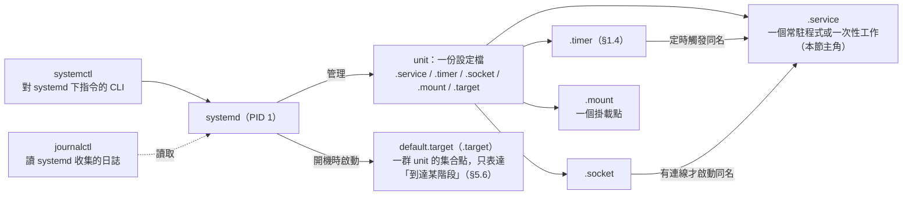
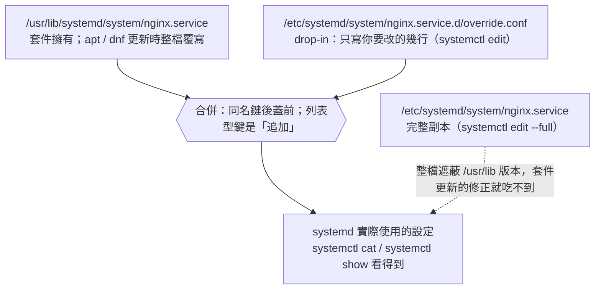
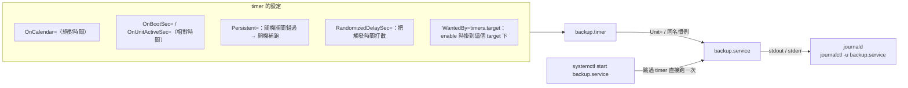
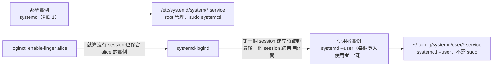

# 04 - 系統管理

本章涵蓋 systemd 服務與 timer、使用者與權限、程序管理、排程、核心與開機管理。範例單元檔在 [`scripts/examples/`](scripts/examples/)，已在兩個發行版實際啟動驗證。

**本章解決什麼問題**：一台伺服器交付後，日常運維九成的工作就落在這幾件事：服務掛了要拉起來、半夜要跑備份、幫新同事開帳號又不能給太多權限、記憶體被吃光時得知道是誰、核心更新後開不了機得救得回來。這些事在 Ubuntu 與 Fedora 上的**做法幾乎相同**（都是 systemd），真正的差異只在服務名稱、預設值與少數工具（`update-grub` vs `grubby`、`initramfs-tools` vs `dracut`）。本章的取捨原則：能用 systemd 原生機制（timer、drop-in、資源限制）就不用舊做法（cron、直接改 `/usr/lib`、limits.conf），因為前者在兩個發行版上行為一致，且能被 `systemctl` 與 `journalctl` 統一管理。

---

## 1. systemd 服務管理

**名詞與關係**：本章大半的操作都繞著 systemd 的「unit（單元）」打轉，先把層級對好：



<details><summary>純文字版（不支援 Mermaid 的閱讀器）</summary>

```
systemd（PID 1）──管理──▶ unit：一份 .service / .timer / .socket / .mount / .target 設定檔
    │                        ├─ .service：一個常駐程式或一次性工作（本節主角）
    │  systemctl：對 systemd 下指令的 CLI      ├─ .timer  ──定時觸發──▶ 同名 .service（§1.4）
    │  journalctl：讀 systemd 收集的日誌       ├─ .socket ──有連線才啟動──▶ 同名 .service
    │                                        ├─ .mount：一個掛載點
    └─ 開機時啟動 default.target ────────────▶ .target：一群 unit 的集合點，只表達「到達某階段」（§5.6）
```

</details>

| 名詞 | 一句話定義 | 與其他名詞的關係 |
|---|---|---|
| **systemd** | Linux 開機後第一個程序（PID 1），負責啟動、監看、停止所有服務並管理它們的資源 | 兩個發行版都用它，所以本節指令完全相同；unit、target、journald 都是它的一部分 |
| **unit（單元）** | systemd 管理的最小對象，每個 unit 對應一份 INI 格式的單元檔，副檔名決定類型 | service / timer / socket / mount / target 都是 unit 的類型，`systemctl` 所有子指令都作用在 unit 上 |
| **service** | 描述「怎麼啟動、監看、重啟一個程式」的 unit 類型 | 日常說的「服務」就是它；timer 與 socket 只負責「何時 / 何種條件下」啟動某個 service |
| **timer / socket / mount** | 分別是「定時觸發」「有連線時才啟動」「掛載一個檔案系統」的 unit 類型 | 三者都不自己跑程式，而是觸發或搭配同名的 service / 掛載點；timer 見 §1.4 |
| **target** | 沒有實體動作、只用來把一群 unit 綁在一起、代表「開機到達某個階段」的 unit 類型 | `multi-user.target`、`graphical.target` 是開機終點；`WantedBy=multi-user.target` 表示「進入多人模式時一起拉起」，細節見 §5.6 |
| **systemctl / journalctl** | 前者是對 systemd 下指令的 CLI，後者讀取 systemd 的日誌服務 journald 收集的日誌 | 本章操作全靠 systemctl；`systemctl status` 順便顯示 journalctl 的最後幾行 |
| **服務名稱** | service unit 的名字（`nginx.service`，`.service` 可省略） | 兩者唯一的差異來源：同一套件在 Ubuntu / Fedora 的 unit 名稱可能不同 |

**為什麼**：兩者都使用 systemd，指令 **完全相同**，只有部分服務名稱不同（`ssh` vs `sshd`、`apache2` vs `httpd`、`cron` vs `crond`）。學會一套就能同時管兩個發行版；跨發行版踩到的坑幾乎都是「服務叫什麼名字」而不是「怎麼操作」。

### 1.1 基本操作

**名詞與關係**：`systemctl status` 一行輸出裡就同時出現 PID、cgroup、enable / start、drop-in 幾個概念：

| 名詞 | 一句話定義 | 與其他名詞的關係 |
|---|---|---|
| **PID / 主程序** | 程序識別碼；systemd 為每個 service 記錄一個「主程序」（MainPID），用它判斷服務是否還活著 | `status` 顯示 Main PID；§1.3 的 `Type=` 就是在告訴 systemd 哪個程序才是主程序 |
| **cgroup** | 核心的「控制群組」：把一群程序放進同一個資源帳戶，可統計與限制 CPU / 記憶體 | systemd 為每個 service 建一個 cgroup，所以 `status` 能列出服務底下所有程序、`stop` 能連子程序一起殺乾淨 |
| **start / stop / restart / reload** | 對「現在」的操作：啟動、停止、重啟、不中斷地重讀設定 | 只影響當下狀態，重開機後不保留 |
| **enable / disable** | 對「開機時」的操作：在 target 的 `.wants/` 目錄建立 / 移除符號連結 | 只影響下次開機；`--now` 把兩件事合併 |
| **mask / unmask** | 把 unit 檔連結到 `/dev/null`，讓它連被相依關係拉起都不可能 | 比 disable 更強：disable 只拿掉開機自啟，相依它的服務仍能把它啟動 |
| **drop-in** | 放在 `<unit>.d/*.conf` 的片段設定檔，與原單元檔合併生效 | `systemctl cat` 會一併顯示；改完必須 `daemon-reload`（§1.2 詳述） |
| **daemon-reload** | 要求 systemd 重新讀取磁碟上所有單元檔與 drop-in | systemd 把單元檔載入記憶體後就不再看磁碟，所以改檔不 reload 等於沒改 |
| **start limit** | systemd 的防護：同一 unit 在短時間內（預設 10 秒 5 次）啟動失敗太多次就拒絕再啟動 | 進入此狀態要 `reset-failed` 清掉計數才能再 `start` |

**為什麼**：服務出問題時第一個動作永遠是 `systemctl status`——它同時給你狀態、PID、cgroup 與最近幾行日誌，比先翻 `/var/log` 快得多。`enable` 與 `start` 是兩件事：只 `start` 重開機就消失、只 `enable` 現在不會跑，漏掉其中一個就是「明明設好了，怎麼重開就沒了」的來源。`mask` 則用來防止相依關係把你不想跑的服務悄悄拉起來。

**怎麼做**：

```bash
systemctl status nginx                 # 狀態 + 最近日誌
sudo systemctl start|stop|restart|reload nginx
sudo systemctl reload-or-restart nginx # 支援 reload 就 reload，否則 restart
sudo systemctl enable --now nginx      # 開機自啟 + 立即啟動
sudo systemctl disable --now nginx
sudo systemctl mask nginx              # 完全禁止啟動（連相依都拉不起來）
sudo systemctl unmask nginx
systemctl is-active nginx; systemctl is-enabled nginx; systemctl is-failed nginx

systemctl list-units --type=service              # 執行中的服務
systemctl list-units --type=service --all        # 含未啟動
systemctl list-unit-files --state=enabled        # 開機啟動清單
systemctl --failed                               # 失敗的單元
systemctl list-dependencies nginx                # 相依樹
systemctl cat nginx                              # 看單元檔全文（含 drop-in）
systemctl show nginx -p MainPID -p MemoryCurrent # 查屬性
sudo systemctl daemon-reload                     # 修改單元檔後必做
sudo systemctl reset-failed                      # 清除 failed 狀態
```

**注意**：改過單元檔（含 drop-in）沒跑 `daemon-reload`，systemd 會繼續用舊設定，只在 status 裡給一行警告；服務反覆失敗觸發 start limit 後，要 `reset-failed` 才能再啟動。

### 1.2 單元檔位置與優先權

**名詞與關係**：



<details><summary>純文字版（不支援 Mermaid 的閱讀器）</summary>

```
/usr/lib/systemd/system/nginx.service            ← 套件擁有，apt / dnf 更新時整檔覆寫
        +
/etc/systemd/system/nginx.service.d/override.conf ← drop-in：只寫你要改的幾行（systemctl edit）
        ‖ 合併：同名鍵後蓋前；列表型鍵是「追加」
        ▼
   systemd 實際使用的設定（systemctl cat / systemctl show 看得到）

/etc/systemd/system/nginx.service                 ← 完整副本（systemctl edit --full）：整檔遮蔽 /usr/lib 版本，套件更新的修正就吃不到
```

</details>

| 名詞 | 一句話定義 | 與其他名詞的關係 |
|---|---|---|
| **單元檔（unit file）** | 描述一個 unit 的 INI 檔，分 `[Unit]`、`[Service]`、`[Install]` 等段 | 同名檔可出現在三層目錄，systemd 只取優先權最高那一份 |
| **三層目錄** | `/usr/lib`（套件）、`/run`（執行期自動產生）、`/etc`（管理員），後者優先 | 讓「套件預設」與「管理員覆寫」分開存放，套件更新只動 `/usr/lib` |
| **drop-in** | `<unit>.d/` 目錄下的 `.conf` 片段，與所有層級的同名單元檔合併 | 不遮蔽原檔、只覆寫寫到的鍵；`systemctl edit` 就是幫你建立它 |
| **完整覆寫（`edit --full`）** | 把整份單元檔複製到 `/etc` 再改 | 原檔完全被遮蔽，套件更新帶來的修正吃不到；只在 drop-in 表達不了時用 |
| **列表型設定** | `ExecStart=`、`Environment=` 這類可以寫多次、值會累積的鍵 | drop-in 裡要先寫一行空值清空再指定，否則變成「追加」 |
| **revert** | 刪除 `/etc` 下該 unit 的所有 drop-in 與完整副本 | 回到純套件預設的最快方法 |

**為什麼**：套件更新會直接覆寫 `/usr/lib/systemd/system/` 下的單元檔，你手改的 `Restart=` 或 `LimitNOFILE=` 會在下一次 `apt upgrade` / `dnf upgrade` 後無聲消失。systemd 設計三層目錄加 drop-in，就是讓「套件的預設」與「管理員的覆寫」分開存放、互不干擾。

| 路徑 | 用途 | 優先權 |
|---|---|---|
| `/etc/systemd/system/` | 管理員自訂 / 覆寫 | 最高 |
| `/run/systemd/system/` | 執行期產生 | 中 |
| `/usr/lib/systemd/system/`（🔵）/ `/lib/systemd/system/`（🟠，是 `/usr/lib` 的符號連結） | 套件安裝的 | 最低 |

**怎麼做**：**不要直接改 `/usr/lib` 下的檔案**（套件更新會覆蓋）。用 drop-in 覆寫：

```bash
sudo systemctl edit nginx              # 建立 /etc/systemd/system/nginx.service.d/override.conf
# 例：
# [Service]
# Restart=always
# LimitNOFILE=65536
sudo systemctl edit --full nginx       # 複製整份到 /etc/systemd/system/ 修改
sudo systemctl revert nginx            # 移除所有覆寫
```

**注意**：⚠️ 覆寫 `ExecStart` 類「列表型」設定時，要先清空再指定（否則會變成兩個 `ExecStart`，非 oneshot 服務會拒絕載入）：
```
[Service]
ExecStart=
ExecStart=/usr/sbin/nginx -c /etc/nginx/custom.conf
```

### 1.3 撰寫服務單元（範例：`scripts/examples/myapp.service`）

**名詞與關係**：單元檔的三段各自回答一個問題——「跟誰有關係」「怎麼跑」「什麼時候被拉起」：

| 名詞 | 一句話定義 | 與其他名詞的關係 |
|---|---|---|
| **`[Unit]` 段** | 描述說明與相依：`Description=`、`After=`、`Wants=` | `After=` 只決定順序、`Wants=` 才會把對方拉起，通常成對寫 |
| **`network-online.target`** | 「網路已經可用（拿到 IP）」的 target | 需要對外連線的服務應同時 `After=` 與 `Wants=` 它，只寫 `network.target` 太早 |
| **`[Service]` 段** | 描述怎麼啟動與限制：`Type=`、`ExecStart=`、`Restart=`、資源與沙箱選項 | 本節大多數設定都在這段 |
| **`Type=`** | 告訴 systemd「主程序是哪一個、何時算啟動完成」 | 選錯會誤判狀態，見本節末的 `Type` 選擇清單 |
| **`sd_notify()`** | 程式主動透過 socket 告知 systemd「我準備好了」的 API | `Type=notify` 就是等這個訊號；程式不支援時不能用 notify |
| **`PIDFile=`** | 傳統 daemon fork 後把子程序 PID 寫進的檔案 | `Type=forking` 靠它找出主程序 |
| **`EnvironmentFile=`** | 從檔案讀 `KEY=VALUE` 環境變數注入程式 | 🟠 慣例放 `/etc/default/`、🔵 放 `/etc/sysconfig/`，是本節少數的發行版差異 |
| **`MemoryMax=` / `CPUQuota=`** | 透過 service 的 cgroup（§1.1）設定記憶體與 CPU 上限 | 超過 MemoryMax 會被核心 OOM 殺（§3.1）；`CPUQuota=200%` 等於兩顆核心 |
| **沙箱選項** | `ProtectSystem=`、`ProtectHome=`、`PrivateTmp=`、`NoNewPrivileges=` 等，用 namespace 與 seccomp 限制程式看得到、改得動的範圍 | `ReadWritePaths=` 是沙箱的例外清單；`StateDirectory=` / `LogsDirectory=` 自動建目錄並自動加進可寫清單 |
| **`[Install]` 段** | 描述 `enable` 時要掛到哪個 target | `WantedBy=multi-user.target` → enable 時在 `multi-user.target.wants/` 建連結 |
| **`systemd-analyze verify` / `security`** | 前者檢查單元檔語法與引用，後者依沙箱選項給出 0～10 的暴露分數 | 寫完單元檔先 verify、再看 security 分數決定要不要多加幾行沙箱 |

**為什麼**：用 `nohup ./app &` 或 `screen` 跑正式服務，重開機就沒了、崩潰沒人拉、日誌散落，也無法限制它吃多少記憶體。寫成 systemd 單元後這些都由 PID 1 接手：自動重啟、cgroup 資源上限、`journalctl -u` 統一看日誌；`ProtectSystem=` 等沙箱選項幾行就能把程式被攻破後的影響範圍縮到自己的目錄內。

**怎麼做**：

```ini
[Unit]
Description=My Application
After=network-online.target
Wants=network-online.target

[Service]
Type=simple                      # simple / forking / oneshot / notify / exec
User=myapp
Group=myapp
WorkingDirectory=/opt/myapp
EnvironmentFile=-/etc/default/myapp    # 🟠 慣例 /etc/default/、🔵 慣例 /etc/sysconfig/；- 表示不存在也不報錯
ExecStart=/opt/myapp/bin/app --port ${PORT}
ExecReload=/bin/kill -HUP $MAINPID
Restart=on-failure
RestartSec=5s
LimitNOFILE=65536
MemoryMax=512M                   # cgroup v2 記憶體上限
CPUQuota=200%                    # 最多 2 顆核心
# 安全強化
NoNewPrivileges=true
ProtectSystem=strict
ProtectHome=true
PrivateTmp=true
ReadWritePaths=/var/lib/myapp /var/log/myapp
StateDirectory=myapp             # 自動建立 /var/lib/myapp 並設好擁有者
LogsDirectory=myapp              # 自動建立 /var/log/myapp

[Install]
WantedBy=multi-user.target
```

安裝、檢查語法、啟動，並用 `systemd-analyze security` 看沙箱強度：

```bash
sudo cp myapp.service /etc/systemd/system/
sudo systemd-analyze verify /etc/systemd/system/myapp.service   # 語法檢查
sudo systemctl daemon-reload && sudo systemctl enable --now myapp
systemd-analyze security myapp        # 安全評分（實測範例為 7.3 MEDIUM；越低越好）
```

**注意**：`Type` 選錯會讓 systemd 誤判服務狀態——會 fork 的 daemon 用了 `simple`，父程序一退出就被當成死掉而反覆重啟；不會 fork 的程式用了 `forking`，則卡在 activating 直到逾時。

`Type` 選擇：
- `simple`（預設）：ExecStart 的程序就是主程序，不會 fork。
- `exec`：同 simple 但等 exec() 成功才算啟動（更準確）。
- `forking`：傳統 daemon 會 fork 到背景；需搭配 `PIDFile=`。
- `oneshot`：跑完就結束的工作（配 `RemainAfterExit=yes` 可保持 active）。
- `notify`：程式用 `sd_notify()` 通知就緒（nginx、postgres 等支援）。

### 1.4 systemd timer（取代 cron）

**名詞與關係**：



<details><summary>純文字版（不支援 Mermaid 的閱讀器）</summary>

```
backup.timer ──Unit= / 同名慣例──▶ backup.service ──stdout/stderr──▶ journald（journalctl -u backup.service）
     │                                    ▲
     │ OnCalendar=（絕對時間）             │ systemctl start backup.service 可跳過 timer 直接跑一次
     │ OnBootSec= / OnUnitActiveSec=（相對時間）
     │ Persistent=：關機期間錯過 → 開機補跑
     │ RandomizedDelaySec=：把觸發時間打散
     └─ WantedBy=timers.target：enable 時掛到這個 target 下
```

</details>

| 名詞 | 一句話定義 | 與其他名詞的關係 |
|---|---|---|
| **timer 單元** | 只負責「何時觸發」的 unit，本身不執行指令 | 觸發同名（或 `Unit=` 指定）的 service；enable 的是 timer 不是 service |
| **被觸發的 service** | 真正做事的單元，通常 `Type=oneshot` | 可單獨 `systemctl start` 立刻跑一次來測試 |
| **`OnCalendar=`** | 類似 crontab 的絕對時間表，語法用 `systemd-analyze calendar` 驗證 | 對應 cron 的五欄；`hourly` / `daily` 這類簡寫也可用 |
| **`OnBootSec=` / `OnUnitActiveSec=`** | 相對時間：開機後多久、上次執行後多久 | 適合「每小時跑一次但不在乎整點」的工作，cron 表達不了 |
| **`Persistent=`** | 記錄上次執行時間，若關機期間錯過就在下次開機補跑 | 對應 anacron 的功能（§4.1） |
| **`RandomizedDelaySec=`** | 在排定時間後加一段隨機延遲 | 多台機器同一 timer 不會同秒打爆共用儲存或 API |
| **`timers.target`** | 所有已 enable 的 timer 掛在其下的 target | 開機到達這個 target 時所有 timer 才開始計時 |
| **cron / MTA** | cron 是傳統排程 daemon（§4.1）；MTA 是寄信程式（postfix、sendmail） | cron 把輸出寄給使用者，沒有 MTA 就直接丟失，timer 進 journald 沒這問題 |

**為什麼**：cron 工作失敗時你通常不會知道——輸出寄到沒有 MTA 的信箱、關機期間錯過的排程不會補跑、也無法限制它吃多少資源。timer 把排程變成一般的 systemd 單元：輸出進 journald、`Persistent=` 補跑、`RandomizedDelaySec=` 避免十幾台機器同一秒打爆共用儲存，還能用 `After=` / `Requires=` 明確宣告相依。

**怎麼做**：`scripts/examples/backup.timer` + `backup.service`：

```ini
# backup.timer
[Unit]
Description=Run nightly backup at 02:30

[Timer]
OnCalendar=*-*-* 02:30:00
RandomizedDelaySec=15m     # 隨機延遲，避免多台機器同時打爆儲存
Persistent=true            # 錯過（關機）時開機後補跑
Unit=backup.service

[Install]
WantedBy=timers.target
```

```bash
sudo systemctl enable --now backup.timer
systemctl list-timers                       # 看下次執行時間
sudo systemctl start backup.service         # 手動立即執行一次
journalctl -u backup.service                # 看輸出（不必自己導向日誌檔）

# OnCalendar 語法測試
systemd-analyze calendar "Mon..Fri *-*-* 09:00"
systemd-analyze calendar "*-*-01 03:00" --iterations 3
# 常用：hourly / daily / weekly / monthly / "*:0/15"（每 15 分鐘）
# 相對時間：OnBootSec=5min / OnUnitActiveSec=1h（上次執行後 1 小時）
```

timer 相對 cron 的優點：日誌進 journald、可設資源限制與相依、`Persistent` 補跑、不需要 MAILTO。

### 1.5 臨時單元與其他實用指令

**名詞與關係**：

| 名詞 | 一句話定義 | 與其他名詞的關係 |
|---|---|---|
| **臨時單元（transient unit）** | 不存在磁碟上、由指令即時建立、結束後自動消失的 unit | `systemd-run` 建立；期間可以像正式 unit 一樣 `systemctl status` / `stop`，也有自己的 cgroup（§1.1） |
| **`systemd-run`** | 把任意指令包成臨時 service（加 `--on-active=` 則包成臨時 timer）的工具 | `-p MemoryMax=` 等屬性直接對應單元檔 `[Service]` 的鍵；`--on-active=` 是 `at`（§4.2）的替代 |
| **`systemd-analyze blame` / `critical-chain` / `plot`** | 依開機時各 unit 的時間戳，列出啟動耗時排名、拖慢開機的因果鏈、畫成 SVG | 三者看的是同一份資料：blame 給排名、critical-chain 給因果、plot 給圖 |
| **`systemd-cgtop`** | 像 `top` 但以 cgroup（也就是 service / slice）為單位顯示資源 | 找「哪個服務在吃記憶體」比 `top` 看單一程序準確 |
| **job** | systemd 內部對「啟動 / 停止某 unit」這件事的排隊項目 | `list-jobs` 看得到卡住的 job，例如等網路逾時的 unit |
| **`isolate` / `set-default`** | 前者立刻切到某 target（停掉不屬於它的 unit）；後者改變開機預設 target | `rescue.target` 是只剩 root shell 與基本掛載的救援 target；各救援層級見 §5.6 |

**為什麼**：臨時跑一個吃資源的大工作（重建索引、壓縮備份）時，直接在 shell 執行會跟正式服務搶 CPU 與記憶體，SSH 斷線還會把它帶走。`systemd-run` 把它包成臨時單元：有 cgroup 限制、脫離終端、可用 `systemctl` 查看與停止。`systemd-analyze` 系列則是開機慢時找出「哪個服務拖了 30 秒」的工具。

**怎麼做**：

```bash
sudo systemd-run --unit=bigjob --nice=19 -p MemoryMax=2G ./heavy.sh     # 以臨時服務執行，可用 systemctl 控制
sudo systemd-run --on-active=30m /usr/bin/systemctl restart nginx       # 30 分鐘後執行（取代 at）
systemd-analyze                        # 開機耗時
systemd-analyze blame                  # 各服務啟動耗時
systemd-analyze critical-chain         # 關鍵路徑
systemd-analyze plot > boot.svg        # 視覺化
systemd-cgtop                          # 依 cgroup 看資源
systemctl list-jobs                    # 卡住的工作
sudo systemctl isolate rescue.target   # 切換到救援模式（單人）
sudo systemctl set-default multi-user.target   # 預設不進圖形介面（Fedora Workstation 改伺服器用）
```

### 1.6 使用者層級服務

**名詞與關係**：



<details><summary>純文字版（不支援 Mermaid 的閱讀器）</summary>

```
系統實例   systemd（PID 1）────────────────▶ /etc/systemd/system/*.service（root 管理，sudo systemctl）
使用者實例 systemd --user（每個登入使用者一個）──▶ ~/.config/systemd/user/*.service（systemctl --user，不需 sudo）
        ▲
        │ 由 logind 在該使用者第一個 session 建立時啟動，最後一個 session 結束時關閉
        └─ loginctl enable-linger alice：告訴 logind「就算沒有 session 也保留 alice 的實例」
```

</details>

| 名詞 | 一句話定義 | 與其他名詞的關係 |
|---|---|---|
| **使用者實例（`systemd --user`）** | 每位登入使用者各自擁有的一個 systemd 程序，以該使用者身分管理自己的 unit | 與系統實例（PID 1）完全獨立，指令用 `systemctl --user` |
| **user service** | 放在 `~/.config/systemd/user/`（或 `/usr/lib/systemd/user/`）的 unit | 只能用該使用者的權限跑，無法綁 1024 以下的埠 |
| **logind / `loginctl`** | `systemd-logind` 負責追蹤登入 session 與使用者實例；`loginctl` 是它的 CLI | 使用者實例的生死由 logind 決定 |
| **session** | 一次登入（SSH、tty、桌面）所對應的 logind 物件 | 預設最後一個 session 結束，使用者實例與其下的 user service 一起被關掉 |
| **linger** | logind 的旗標：即使沒有 session 也保留該使用者的 systemd 實例 | `enable-linger` 是讓 user service 在開機後、未登入時就跑起來的關鍵 |

**為什麼**：Syncthing、個人 bot 這類屬於某個使用者的程式不該用 root 跑成系統服務，但預設使用者登出後其 user service 也會被殺掉。`enable-linger` 讓該使用者的 systemd 實例在未登入時持續存在，是在不給 sudo 的前提下讓使用者自行管理常駐程式的標準做法。

**怎麼做**：

```bash
systemctl --user enable --now syncthing        # ~/.config/systemd/user/
sudo loginctl enable-linger alice              # 使用者未登入時也讓其 user service 執行
loginctl list-sessions; loginctl show-user alice
```

---

## 2. 使用者、群組與權限

**名詞與關係**：

| 名詞 | 一句話定義 | 與其他名詞的關係 |
|---|---|---|
| **帳號 / UID** | 使用者帳號是 `/etc/passwd` 的一筆紀錄，核心只認它的數字 UID | 檔案擁有者、程序身分都是 UID；`/etc/login.defs` 規定一般使用者從 1000 起算 |
| **群組 / GID** | `/etc/group` 的一筆紀錄，讓多個帳號共享權限 | 每個帳號有一個「主群組」（新建檔案的群組）與零到多個「附加群組」（`usermod -aG` 加的） |
| **UPG（User Private Group）** | 建帳號時順便建一個同名、只有本人的主群組 | 兩者都採 UPG；Ubuntu 因此敢把 umask 放寬到 002（§2.2），因為群組裡只有自己 |
| **系統帳號 / 服務帳號** | UID 小於 1000、無密碼、shell 為 `nologin` 的帳號，專給 daemon 用 | `useradd -r` 建立；讓服務被攻破後沒有可登入的 shell |
| **login shell / `nologin`** | `/etc/passwd` 最後一欄，登入時啟動的程式；`nologin` 是「印一句拒絕訊息後退出」的假 shell | 決定帳號能不能互動登入；Ubuntu `useradd` 預設給 `/bin/sh` 是本節主要陷阱 |
| **sudo 群組（🟠 `sudo` / 🔵 `wheel`）** | `/etc/sudoers` 預設授權可執行 `sudo` 的群組 | 名稱不同是兩者管理員帳號設定的第一個差異；`usermod -G`（少 `-a`）會把人踢出這個群組 |

**為什麼**：帳號與權限是多數資安事故的起點——離職者帳號沒鎖、服務帳號能登入 shell、`usermod -G` 少打 `-a` 把管理員踢出 sudo。兩個發行版的 `useradd` 預設值不同（§2.1），照 Ubuntu 習慣寫的腳本搬到 Fedora 通常沒事，反過來則會建出沒有家目錄、shell 是 `sh` 的帳號。

### 2.1 帳號管理

**名詞與關係**：

```
adduser / deluser（🟠 Debian 的互動式包裝；🔵 只是 useradd 的別名）
        │ 呼叫
        ▼
useradd / usermod / userdel（shadow-utils 的底層原語，兩者共通）
        │ 讀預設值：/etc/login.defs（UID 範圍、密碼到期）、/etc/default/useradd（shell、家目錄）
        │ 複製範本：/etc/skel/ → 新家目錄
        ▼
/etc/passwd（帳號、UID、shell）＋ /etc/shadow（密碼雜湊、到期日）＋ /etc/group（群組成員）
        ▲                                   ▲
   passwd / chage 改這裡              gpasswd / usermod -aG 改這裡
```

| 名詞 | 一句話定義 | 與其他名詞的關係 |
|---|---|---|
| **`useradd` / `usermod` / `userdel`** | shadow-utils 提供的底層指令，不互動、適合腳本 | 預設值來自 `/etc/default/useradd` 與 `/etc/login.defs`，兩個發行版填的值不同 |
| **`adduser` / `deluser`** | 🟠 Debian 用 Perl 寫的互動式包裝，會問密碼、姓名並建家目錄 | 🔵 Fedora 的 `adduser` 只是 `useradd` 的符號連結，沒有互動 |
| **`passwd` / `chage`** | 前者設密碼，後者設密碼與帳號的到期日、最短 / 最長使用天數 | 兩者都寫 `/etc/shadow`；`chage -d 0` 讓下次登入必改密碼 |
| **`gpasswd`** | 管理群組成員與群組密碼 | `gpasswd -d` 是把人移出單一群組最安全的方法（`usermod -G` 會重設全部） |
| **`/etc/login.defs`** | 系統層級的帳號政策：UID / GID 範圍、密碼到期預設、是否建家目錄 | Fedora 的 `CREATE_HOME yes` 就寫在這 |
| **`/etc/default/useradd`** | `useradd` 的預設 shell、家目錄根、到期日 | Ubuntu 的 `SHELL=/bin/sh` 就是「預設 shell 是 sh」的來源 |
| **`/etc/skel/`** | 新帳號家目錄的範本（`.bashrc`、`.profile`） | 只在建帳號時複製一次，之後改 skel 不影響既有帳號 |

**為什麼**：自動化腳本用 `useradd`、手動建人用 `adduser`，兩者在 Ubuntu 上是不同程式、預設值也不同；到期日與 `chage` 讓約聘、外包帳號到期自動失效，不必靠人記得去關。`usermod -aG` 的 `-a` 是本節最重要的一個字母。

**怎麼做**：

```bash
# 建立
sudo useradd -m -s /bin/bash -c "Alice Chen" -G sudo alice     # 🟠（-G wheel 🔵）
sudo passwd alice
sudo adduser alice                    # 🟠 互動式（Fedora 的 adduser = useradd）
sudo useradd -r -s /usr/sbin/nologin myapp     # 系統帳號（🔵 nologin 在 /sbin/nologin，但 /usr/sbin 也可用）

# 修改
sudo usermod -aG docker alice          # 加群組（⚠️ 沒有 -a 會把其他群組全清掉）
sudo gpasswd -d alice docker           # 移出群組
sudo usermod -s /bin/zsh alice         # 換 shell
sudo usermod -L alice / -U alice       # 鎖定 / 解鎖
sudo usermod -e 2026-12-31 alice       # 帳號到期日
sudo chage -l alice                    # 密碼政策
sudo chage -d 0 alice                  # 下次登入強制改密碼

# 刪除
sudo userdel -r alice                  # -r 連家目錄與信箱一起刪
sudo deluser --remove-home alice       # 🟠

# 查詢
id alice; groups alice; getent passwd alice; getent group sudo
lastlog; last; who; w
sudo passwd -S alice                   # P=有密碼 L=鎖定 NP=無密碼
```

**注意**：預設值來源：`/etc/login.defs`（UID_MIN=1000、密碼到期預設）、`/etc/default/useradd`（預設 shell、家目錄）、`/etc/skel/`（新帳號家目錄範本）。兩者差異來自 Debian 把互動式的 `adduser` 當主要工具、`useradd` 只是底層原語；Fedora 沒有這一層包裝，所以直接把 `useradd` 的預設調成可用：
- 🟠 Ubuntu `useradd` 預設 **不建家目錄、shell 為 `/bin/sh`**（所以要 `-m -s /bin/bash`，或用 `adduser`）。
- 🔵 Fedora `useradd` 預設 **建家目錄（CREATE_HOME yes）、shell 為 `/bin/bash`**。

### 2.2 檔案權限

**名詞與關係**：

| 名詞 | 一句話定義 | 與其他名詞的關係 |
|---|---|---|
| **ugo / rwx** | 傳統 Unix 權限：三組身分（擁有者 u、群組 g、其他 o）× 三種權限（讀 r、寫 w、執行 x） | `chmod` 改的就是這 9 個位元；八進位 `750` = `rwxr-x---` |
| **`chmod` / `chown`** | 前者改權限位元，後者改擁有者與群組 | 檔案要能被網頁伺服器讀，要同時看群組（chown）與群組權限（chmod） |
| **umask** | 新建檔案時「預設拿掉」的權限遮罩，由 shell 或 PAM 設定 | 002 與 022 的差別在群組可否寫；Ubuntu 因 UPG（§2）用 002，Fedora 用 022 |
| **SUID / SGID / sticky** | 三個特殊位元：執行時換成檔案擁有者身分 / 換成檔案群組（設在目錄上則新檔繼承群組）/ 目錄內只有擁有者能刪自己的檔 | 八進位第四位（4 / 2 / 1）；SUID 是提權漏洞常見來源，所以要定期 `find -perm -4000` |
| **`chattr` / `lsattr`** | 設定與查看檔案系統層級的屬性（`i` 不可變、`a` 只能附加） | 屬性凌駕於權限之上：即使是 root、即使 `rwx` 都有，`+i` 的檔仍不能改或刪 |

**為什麼**：權限設錯有兩種代價：太鬆（`chmod 777` 解決問題）讓任何本機帳號都能改設定檔或植入腳本；太緊則網頁伺服器讀不到靜態檔、日誌寫不進去。umask 在兩個發行版不同，同一支部署腳本建出來的檔案群組權限會不一樣，這是「Ubuntu 上正常、Fedora 上 permission denied」的常見來源。SUID 稽核與 `chattr +i` 則是主機疑似被入侵後檢查、以及防止設定檔被竄改的基本手段。

**怎麼做**：

```bash
chmod 750 dir; chmod u+x,g-w,o= file; chmod -R g+rX dir    # X：只對目錄與已可執行檔加 x
chown alice:www-data file; chown -R alice: dir              # 🟠 網頁群組 www-data；🔵 為 apache / nginx
umask                                    # 實測：🟠 一般使用者 002（搭配 UPG 私人群組）、root 022；🔵 一律 022

# 特殊權限
chmod u+s /usr/bin/prog                  # SUID：以檔案擁有者身分執行
chmod g+s /srv/share                     # SGID 目錄：新檔案繼承群組
chmod +t /tmp                            # Sticky：只有擁有者能刪自己的檔
find / -perm -4000 -type f 2>/dev/null   # 找出所有 SUID 檔（安全稽核）

# 不可變屬性（連 root 都不能改，防誤刪設定檔）
sudo chattr +i /etc/resolv.conf; lsattr /etc/resolv.conf; sudo chattr -i /etc/resolv.conf
sudo chattr +a /var/log/app.log          # 只能附加
```

### 2.3 ACL（細緻權限）

**名詞與關係**：

| 名詞 | 一句話定義 | 與其他名詞的關係 |
|---|---|---|
| **ACL（Access Control List）** | 在 ugo 之外，對「指定使用者 / 群組」逐一授權的擴充權限，存在檔案系統的擴充屬性裡 | 補 ugo 只能表達一個擁有者、一個群組的不足；SGID 目錄能解決群組繼承，ACL 能解決多群組、多使用者 |
| **預設 ACL（default ACL）** | 只能設在目錄上，新建的子檔案 / 子目錄會自動繼承成自己的 ACL | `setfacl -d` 設定；沒有它每個新檔都要重新授權 |
| **`setfacl` / `getfacl`** | 設定 / 讀取 ACL 的工具（`acl` 套件） | `ls -l` 只在權限尾巴顯示 `+`，內容一定要 `getfacl` 才看得到 |

**為什麼**：傳統 ugo 權限只能表達「一個擁有者、一個群組、其他人」；當共享目錄要讓 `devs` 可寫、`bob` 只能讀、網頁伺服器又要另一種權限時，靠一堆群組與 SGID 拼湊會越來越難維護。ACL 直接對單一使用者或群組授權，預設 ACL 還能讓新建檔案自動繼承，不必每次 `chmod`。

**怎麼做**：

```bash
sudo apt install -y acl      # 🟠 需安裝     /   sudo dnf install -y acl   # 🔵 標準安裝已含，最小化 / 容器環境可能沒有
setfacl -m u:bob:rx /srv/data            # 給 bob 讀取
setfacl -m g:devs:rwx /srv/data
setfacl -d -m g:devs:rwx /srv/data       # 預設 ACL：新檔案自動繼承
setfacl -R -m u:bob:rx /srv/data         # 遞迴
getfacl /srv/data
setfacl -b /srv/data                     # 移除所有 ACL
# ls -l 顯示 "+" 代表有 ACL（如 drwxr-xr-x+）
```

**注意**：`ls -l` 只顯示一個 `+`，看不到 ACL 內容；排查權限問題時記得 `getfacl`，否則會被 `rwxr-x---` 的表象誤導。

### 2.4 資源限制（ulimit / limits.conf）

**名詞與關係**：

```
互動登入（SSH / tty）─▶ PAM ─▶ pam_limits ─讀▶ /etc/security/limits.conf、limits.d/*.conf ─▶ shell 的 ulimit（可再往下調）
systemd 啟動的服務   ─▶ 不經 PAM ─▶ 只看單元檔 Limit*=（LimitNOFILE=…）與 /etc/systemd/system.conf 的 Default*=
```

| 名詞 | 一句話定義 | 與其他名詞的關係 |
|---|---|---|
| **檔案描述符（fd）** | 程序每開一個檔案 / socket 就佔用一個整數編號的描述符 | `nofile` 限制的是這個數量；連線越多的服務越容易撞到上限 |
| **`ulimit`** | shell 內建指令，顯示或調整「目前 shell 與其子程序」的資源上限 | 只影響當前 session，重新登入就恢復 |
| **soft / hard limit** | soft 是實際生效值、程序可自行調高到 hard；hard 是天花板，只有 root 能提高 | `limits.conf` 每列都要指定是哪一種 |
| **PAM / `pam_limits`** | PAM 是登入時的可插拔認證框架；`pam_limits` 模組在登入那一刻讀 `limits.conf` 套用 | 這就是 limits.conf 只對「登入 session」有效的原因 |
| **`limits.conf` / `limits.d/`** | `pam_limits` 的設定檔，格式「誰 soft/hard 項目 值」 | 服務不走登入流程，所以對 systemd 服務無效 |
| **`LimitNOFILE=` / `DefaultLimitNOFILE=`** | systemd 單元檔與全域設定裡對應 `nofile` 的鍵（其他如 `LimitNPROC=`） | 這是給服務改上限的正確位置，改完 `daemon-reload` 並重啟服務 |

**為什麼**：預設每個程序只能開 1024 個檔案，資料庫、反向代理、Elasticsearch 在連線一多時就報 `Too many open files`。最常見的錯誤是改了 `limits.conf` 卻沒效——它只對 PAM 登入 session 生效，systemd 啟動的服務根本不經過 PAM。

**怎麼做**：

```bash
ulimit -a                                # 目前 shell 限制
ulimit -n 65536                          # 暫時改開檔數（soft）
# 永久：/etc/security/limits.d/90-custom.conf（PAM 登入 session 生效）
#   *       soft    nofile   65536
#   *       hard    nofile   131072
#   alice   soft    nproc    4096
# ⚠️ systemd 服務不吃 limits.conf，要在單元檔用 LimitNOFILE= 等設定
# 全域預設：/etc/systemd/system.conf 的 DefaultLimitNOFILE=
```

---

## 3. 程序管理

**名詞與關係**：

| 名詞 | 一句話定義 | 與其他名詞的關係 |
|---|---|---|
| **程序 / PID / PPID** | 執行中的程式實例；PID 是其編號、PPID 是父程序編號 | `ps --forest` 依 PPID 畫樹；殺父程序時要注意子程序會變孤兒 |
| **信號（signal）：TERM / KILL / HUP** | 核心送給程序的通知：TERM 請它自行結束、KILL 由核心直接終止不給機會、HUP 慣例上表示「重讀設定」 | `kill -15` / `-9` / `-HUP` 就是這三個；只有 KILL 無法被程式攔截 |
| **nice / ionice** | 分別是 CPU 排程優先權（-20～19，越大越禮讓）與 I/O 優先權（class 3 = idle） | 讓背景大工作不影響服務；對已在跑的程序用 `renice` / `ionice -p` |
| **`nohup` / `setsid` / `tmux` / `screen`** | 前兩者讓程式脫離終端、不被 SIGHUP 帶走；後兩者是可離線再接回的終端多工器 | 長時間互動工作用 tmux，純背景工作用 `systemd-run`（§1.5）比 nohup 好 |
| **檔案描述符（fd）** | 程序開啟的每個檔案 / socket / 埠的編號（§2.4） | `ls /proc/PID/fd` 與 `lsof` 看的就是它；刪檔後空間沒回來就是 fd 還被握著 |
| **`/proc/PID/`** | 核心以虛擬檔案系統形式暴露的每個程序資訊 | `ps`、`top`、`lsof` 都是讀這裡再排版 |
| **`lsof` / `ss`** | 列出開啟的檔案（含 socket）/ 列出 socket 與監聽埠 | 「誰佔了 80 埠」用 `lsof -i` 或 `ss -ltnp` 都能答 |
| **`strace`** | 追蹤程序發出的系統呼叫 | 程式卡住又沒日誌時的最後手段 |
| **殭屍 / 孤兒** | 殭屍：已結束但父程序沒回收退出狀態的程序（狀態 Z）；孤兒：父程序先死、被 PID 1 收養的程序 | 殭屍殺不掉，只能處理其父程序；孤兒本身正常 |
| **job control** | shell 對自己啟動的背景工作（`&`、`Ctrl-Z`）的管理 | `jobs` / `fg` / `bg` / `disown` 只認得目前 shell 的工作，不是系統層級 |

**為什麼**：機器變慢、埠被佔、刪了大檔案空間卻沒回來，答案都在程序層：誰吃 CPU、誰握著檔案描述符、誰佔了 80 埠。`kill -9` 應是最後手段——它不給程式寫完緩衝、釋放鎖的機會，資料庫類服務被 `-9` 後常要跑修復。長時間工作一律放進 `tmux`，SSH 斷線才不會把它帶走。

**怎麼做**：

```bash
ps aux --sort=-%mem | head              # 記憶體前幾名
ps -eo pid,ppid,user,%cpu,%mem,etime,cmd --sort=-%cpu | head
ps -ef --forest                          # 樹狀
pstree -p
top / htop / btop                        # 互動式（htop 需安裝；btop 更漂亮）
pgrep -a nginx; pidof nginx
kill -15 PID（TERM，優雅）; kill -9 PID（KILL，強制）; kill -HUP PID（重載）
pkill -f "python app.py"; killall nginx
nice -n 10 cmd; renice -n 5 -p PID       # CPU 優先權（-20 最高 ~ 19 最低）
ionice -c 3 -p PID                       # I/O 優先權（3 = idle）
nohup cmd &; setsid cmd                  # 脫離終端
tmux / screen                            # 長時間工作必用

# 背景工作
jobs; fg %1; bg %1; Ctrl-Z; disown -h %1

# 程序細節
cat /proc/PID/status; ls -l /proc/PID/fd; cat /proc/PID/limits
sudo lsof -p PID                         # 開啟的檔案
sudo lsof -i :80                         # 誰佔了 80 埠
sudo ss -ltnp                            # 監聽埠與程序
sudo strace -p PID -f -e trace=network   # 系統呼叫追蹤
sudo cat /proc/PID/environ | tr '\0' '\n'

# 殭屍與孤兒
ps -eo pid,ppid,stat,cmd | awk '$3 ~ /Z/'     # 找殭屍（Z），需 kill 其父程序
```

### 3.1 OOM Killer

**名詞與關係**：

```
記憶體吃緊
   │
   ├─ 先：systemd-oomd（使用者空間，看 PSI 壓力指標與 cgroup 用量）→ 整個 cgroup（整個服務 / 使用者 slice）一起殺
   │
   └─ 後：核心 OOM Killer（真的分配不出頁面時）→ 依 oom_score 挑「一個」程序殺
                                                  ▲
                               oom_score_adj / OOMScoreAdjust= 在這裡加減分
```

| 名詞 | 一句話定義 | 與其他名詞的關係 |
|---|---|---|
| **OOM Killer** | 核心在記憶體真正耗盡時的最後手段：挑一個程序殺掉釋放記憶體 | 觸發後只留在 `dmesg` / `journalctl -k`；被殺的通常是最肥的那個 |
| **`oom_score` / `oom_score_adj`** | 每個程序的「被殺優先分數」（越高越先）與管理員可加減的調整值（-1000～1000） | -1000 等於免死；透過 `/proc/PID/` 設定，程序重啟就失效 |
| **`OOMScoreAdjust=`** | 單元檔 `[Service]` 裡對應 `oom_score_adj` 的鍵 | 讓服務每次啟動都自動帶上保護值，比手改 `/proc` 持久 |
| **`systemd-oomd`** | systemd 提供的使用者空間 OOM 守護程序，依 PSI 提早介入，以 cgroup 為單位整組殺 | 在核心 OOM 之前動手，行為不同（殺整個 cgroup 而非單一程序）；`oomctl` 查它的狀態 |
| **PSI（Pressure Stall Information）** | 核心提供的資源壓力指標：程序因等記憶體而停滯的時間比例 | systemd-oomd 的判斷依據，不是看剩多少記憶體 |
| **slice** | systemd 用來把 cgroup 分層的 unit 類型（`system.slice`、`user.slice`、`user-1000.slice`） | systemd-oomd 監看與殺戮的單位就是 slice / cgroup |

**為什麼**：記憶體耗盡時核心會挑分數最高的程序殺掉，通常就是你最重要、吃最多記憶體的資料庫或 JVM。事後只有 `dmesg` 這一條線索；事前用 `oom_score_adj` / `OOMScoreAdjust=` 把關鍵服務保護起來，讓核心先殺別的。兩個發行版都有 `systemd-oomd` 在核心 OOM 之前介入，行為與傳統 OOM Killer 不同，排查時兩邊都要看。

**怎麼做**：

```bash
dmesg -T | grep -i "out of memory"       # 或 journalctl -k -g "Out of memory"
cat /proc/PID/oom_score                  # 分數越高越先被殺
echo -1000 | sudo tee /proc/PID/oom_score_adj     # 保護關鍵程序（-1000 ~ 1000）
# systemd 服務：OOMScoreAdjust=-900
# 🔵 Fedora 33+ 預設啟用 systemd-oomd（使用者層級 cgroup 先殺）；🟠 Ubuntu 22.04+ 桌面版也啟用
systemctl status systemd-oomd; oomctl
```

---

## 4. 排程：cron、at 與 timer

**名詞與關係**：

| 名詞 | 一句話定義 | 與其他名詞的關係 |
|---|---|---|
| **cron** | 傳統 Unix 排程 daemon，依 crontab 裡的「分 時 日 月 週」表達式定期執行指令 | 大量既有腳本與套件（`/etc/cron.d/`）仍靠它；細節見 §4.1 |
| **anacron** | cron 的補跑機制：機器沒開時錯過的每日 / 每週工作在開機後補跑 | 兩者都用它跑 `/etc/cron.daily` 等目錄；systemd timer 的 `Persistent=` 是同樣功能 |
| **at** | 一次性排程：在某個時間點跑一次就丟 | 靠 `atd` 守護程序執行；§4.2 |
| **systemd timer** | §1.4 介紹的 systemd 原生排程 unit | 日誌、相依、資源限制都比 cron / at 完整，新工作建議用它 |

**為什麼**：排程工作「沒跑」與「跑了但失敗」在 cron 上都很安靜，備份壞了往往幾週後才發現。本節仍列出 cron 與 at，因為大量既有腳本與第三方套件仍在用；新工作建議用 §1.4 的 timer。

### 4.1 cron

**名詞與關係**：

```
cron daemon（🟠 cron / 🔵 crond，套件 cron / cronie）每分鐘掃描：
  ├─ /var/spool/cron/…                          ← 個人 crontab（crontab -e 編輯，不要直接改檔）
  ├─ /etc/crontab、/etc/cron.d/*                ← 系統 crontab，多一個「使用者」欄位
  └─ /etc/cron.{hourly,daily,weekly,monthly}/   ← 由 run-parts 逐一執行目錄內腳本
                                                   （daily / weekly / monthly 實際由 anacron 依 /etc/anacrontab 觸發）
每個工作的輸出 ──▶ 寄信給 MAILTO（沒有 MTA 就丟失）
```

| 名詞 | 一句話定義 | 與其他名詞的關係 |
|---|---|---|
| **cron daemon（`cron` / `crond`）** | 常駐程序，每分鐘檢查所有 crontab 並執行到期工作 | 🟠 套件與服務都叫 `cron`；🔵 套件 `cronie`、服務 `crond`，最小安裝可能沒裝 |
| **crontab** | 既是「排程表檔案」也是編輯它的指令（`crontab -e`） | 個人 crontab 存於 spool 目錄；系統 crontab 在 `/etc/crontab` 與 `/etc/cron.d/` |
| **`/etc/cron.d/`** | 套件放自己排程的目錄，格式同 `/etc/crontab`（含使用者欄） | 套件更新可能覆寫，自訂工作放自己的檔名 |
| **`/etc/cron.{hourly,…}/` 與 `run-parts`** | 把腳本丟進目錄就按週期執行；`run-parts` 負責逐一執行且忽略含 `.` 的檔名 | 檔名有 `.sh` 就不會跑，是最常見的「放了沒動」原因 |
| **anacron / `/etc/anacrontab`** | 以「天」為單位的排程器，記錄上次執行日期，開機後補跑錯過的 | 桌機、筆電必要；伺服器多半 24 小時開機所以感覺不到它 |
| **`MAILTO` / MTA** | crontab 頂端變數指定輸出寄給誰；MTA 是實際寄信的程式 | 沒裝 MTA 就等於輸出被丟掉，所以慣例把輸出導向檔案或設 `MAILTO=""` |
| **`cron.allow` / `cron.deny`** | 允許 / 禁止使用 crontab 的使用者清單 | 存在 allow 檔時只有其中的人能用 |

**為什麼**：cron 的執行環境與互動 shell 完全不同——沒有你的 PATH、沒有 alias、`%` 有特殊意義——「手動跑正常、cron 跑失敗」幾乎都是這幾個陷阱。兩者套件與服務名稱不同（`cron` vs `cronie` / `crond`），且 Fedora 最小安裝可能根本沒裝，寫自動化前先確認 `crond` 存在。

**怎麼做**：

```bash
# 套件與服務
# 🟠 cron 套件、服務 cron        🔵 cronie 套件、服務 crond
crontab -e                        # 個人 crontab
crontab -l; crontab -r
sudo crontab -u alice -l
# 系統 crontab：/etc/crontab（多一個「使用者」欄位）與 /etc/cron.d/*
# 週期目錄：/etc/cron.{hourly,daily,weekly,monthly}/（腳本檔名不可有 . 否則 run-parts 忽略）
```

```
# ┌ 分(0-59) ┌ 時(0-23) ┌ 日(1-31) ┌ 月(1-12) ┌ 週(0-7, 0/7=日)
# *          *          *          *          *   command
  30 2  * * *     /usr/local/bin/backup.sh >> /var/log/backup.log 2>&1
  */15 * * * *    /usr/local/bin/check.sh
  0 9  * * 1-5    /usr/local/bin/report.sh
  @reboot         /usr/local/bin/on-boot.sh
  @daily          /usr/local/bin/cleanup.sh
```

**注意**：cron 陷阱：
- 環境變數極少（PATH 只有 `/usr/bin:/bin`）→ 指令用絕對路徑，或在 crontab 頂端設 `PATH=`。
- `%` 在 crontab 內是換行符，要寫成 `\%`（如 `date +\%F`）。
- 輸出預設寄信給使用者（沒 MTA 就丟失）→ 導向到檔案或用 `MAILTO=""`。
- 🟠 Ubuntu 的 `/etc/cron.daily` 由 `anacron` 執行（桌機關機也會補跑）；🔵 Fedora 的 `cronie-anacron` 同理，時間在 `/etc/anacrontab`。
- 存取控制：`/etc/cron.allow`、`/etc/cron.deny`。
- 🔵 Fedora Server 最小安裝**未必有 cronie**：`sudo dnf install -y cronie && sudo systemctl enable --now crond`。

### 4.2 at（一次性）

**為什麼**：「凌晨三點重啟一次 nginx」這種一次性工作用 cron 要記得事後刪掉，`at`（一次性排程指令：把工作交給常駐的 `atd` 守護程序在指定時刻執行一次；`atq` 列出佇列、`atrm` 移除）跑完即丟。但 `at` 兩個發行版都不預裝、也沒有日誌整合；同樣的事 `systemd-run --on-active=`（§1.5）不用裝套件就能做。

**怎麼做**：

```bash
sudo apt install -y at   # 🟠      sudo dnf install -y at   # 🔵
sudo systemctl enable --now atd
echo "systemctl restart nginx" | at 03:00 tomorrow
at now + 2 hours -f script.sh
atq; atrm 3
```

💡 新系統建議一律用 **systemd timer**（§1.4）取代 cron / at。

---

## 5. 核心與開機管理

**名詞與關係**：本節五個小節其實對應開機鏈上的五個環節：

```
韌體（UEFI / BIOS）─▶ GRUB（開機載入器；讀 grub.cfg / BLS 項目，把「核心參數」交給核心）
                        │
                        ▼
         vmlinuz（核心本體）＋ initramfs（早期根檔案系統：含掛載真正 / 所需的驅動模組）
                        │  載入核心模組（modprobe，受 modprobe.d 的黑名單 / options 影響）
                        ▼
                 掛載真正的根檔案系統 ─▶ systemd（PID 1）─▶ 套用 sysctl ─▶ default.target
```

| 名詞 | 一句話定義 | 與其他名詞的關係 |
|---|---|---|
| **核心（kernel）/ `vmlinuz`** | Linux 核心本體，以套件形式安裝到 `/boot/vmlinuz-<版本>` | 唯一「更新壞了就開不了機」的套件，所以保留舊版；§5.1 |
| **GRUB** | 兩者預設的開機載入器（bootloader）：顯示選單、載入核心與 initramfs、傳遞核心參數 | 設定來自 `/etc/default/grub`，套用方式兩者不同；§5.2 |
| **核心參數（cmdline）** | GRUB 交給核心的一行文字（`quiet`、`console=`、`systemd.unit=`…），開機後見於 `/proc/cmdline` | 只在開機當下生效；執行期可調的是 sysctl（§5.5） |
| **initramfs** | 隨核心一起載入記憶體的暫時根檔案系統，內含掛載真正根目錄所需的驅動與工具 | 內容是核心模組的副本，所以改黑名單或換儲存控制器後要重建；§5.3 |
| **核心模組** | 可動態載入的驅動與功能（`.ko` 檔） | 早期開機從 initramfs 載、之後從 `/lib/modules/` 載；§5.4 |
| **模組黑名單** | `/etc/modprobe.d/` 裡禁止自動載入某模組的設定 | 要對早期開機生效必須重建 initramfs，是本節最常見的「改了沒效」 |
| **GRUB 選單** | 開機時列出所有已安裝核心的畫面 | 新核心開不了機時從這裡選舊核心，所以 `GRUB_TIMEOUT` 不要設 0 |

**為什麼**：核心是唯一「更新失敗就進不了系統」的套件，所以兩個發行版都保留舊核心當退路；開機參數、initramfs、模組黑名單改錯的後果同樣是開不了機。本節的共通原則：改之前確認舊核心還在、改之後知道怎麼在 GRUB 選單退回。

### 5.1 核心版本與套件

**名詞與關係**：

| 名詞 | 一句話定義 | 與其他名詞的關係 |
|---|---|---|
| **`/boot`** | 存放 `vmlinuz`、initramfs、GRUB 檔案的分割區或目錄，常只有 1 GB | 每個核心版本佔 100～200 MB，舊核心不清就塞滿 |
| **核心套件** | 🟠 `linux-image-<版本>`（由 `linux-generic` 這個中繼套件拉最新）；🔵 `kernel` 中繼套件 + `kernel-core`（本體）+ `kernel-modules` | 兩者都是「中繼套件指向最新版、實體套件每版一個」，所以可以同時裝多版 |
| **LTS / HWE** | Ubuntu LTS 五年固定同一核心大版本；HWE（Hardware Enablement）是為 LTS 額外提供的較新核心 | 新硬體在 LTS 原生核心上沒驅動時裝 HWE |
| **installonly 套件 / `installonly_limit`** | dnf 把核心視為「只安裝不升級」的套件，每版並存；`installonly_limit` 規定最多保留幾版 | 超過上限時 dnf 自動刪最舊的，所以 Fedora 不靠 autoremove 清核心 |
| **`apt autoremove --purge` / `apt-mark hold`** | 前者移除不再需要的套件（含舊核心，保留目前與前一版）；後者鎖住某套件不被移除或升級 | 要保留特定舊核心當退路就 hold 它 |
| **`dnf needs-restarting -r`** | 檢查是否有更新（含核心）需要重開機才生效 | Fedora 核心更新頻繁，用它判斷何時該重開 |

**為什麼**：舊核心不清會把 `/boot`（常常只有 1 GB）塞滿，下次更新在半途失敗；清太乾淨則沒有退路。兩者差異來自發行週期：Ubuntu LTS 核心五年不換大版本，要新硬體支援得裝 HWE 核心；Fedora 跟著上游每 1～2 週更新，所以用 `installonly_limit` 自動保留最近三版，而不是靠 `autoremove`。

**怎麼做**：

```bash
uname -r; hostnamectl | grep Kernel

# 🟠 Ubuntu
dpkg -l 'linux-image-*' | grep ^ii              # 已安裝核心
sudo apt install linux-generic-hwe-24.04         # HWE 核心（較新，24.04.x 點釋出隨附；實測 24.04 HWE 為 7.0）
sudo apt autoremove --purge                      # 清舊核心（保留目前與前一版）
# 保留特定核心：sudo apt-mark hold linux-image-6.8.0-xx-generic

# 🔵 Fedora
rpm -q kernel-core                               # 已安裝核心（預設保留 3 個）
grep installonly_limit /etc/dnf/dnf.conf         # 保留數量；dnf5 預設 3 且不寫在檔內，要改就在 [main] 加 installonly_limit=5
sudo dnf remove --oldinstallonly                 # 刪到只剩 installonly_limit 個
sudo dnf remove kernel-core-7.0.0-100.fc44       # 刪特定版本
# 🔵 Fedora 每 1~2 週更新核心；升級後需重開機，dnf needs-restarting -r 會提示
```

### 5.2 GRUB 與開機參數

**名詞與關係**：

```
/etc/default/grub（兩者共通的設定來源：GRUB_CMDLINE_LINUX*、GRUB_TIMEOUT、序列主控台）
   │
   ├─ 🟠 update-grub = grub-mkconfig ──▶ /boot/grub/grub.cfg（單一大檔，每個核心一個 menuentry）
   │
   └─ 🔵 grub2-mkconfig ──▶ /boot/grub2/grub.cfg（只含框架，用 blscfg 模組動態讀取 ▼）
                                /boot/loader/entries/<machine-id>-<版本>.conf（BLS：每個核心一檔）
                                          ▲ grubby 直接改這些檔（--args / --remove-args / --set-default）
                                          （新核心安裝時由 kernel-install 產生，參數複製自 /etc/kernel/cmdline）
開機 ──▶ GRUB 讀 menuentry / BLS 項目 ──▶ 把 options 那行當核心參數交給 vmlinuz ──▶ /proc/cmdline
```

| 名詞 | 一句話定義 | 與其他名詞的關係 |
|---|---|---|
| **`/etc/default/grub`** | 產生 GRUB 設定的「來源」變數檔 | 直接改 `grub.cfg` 會在下次重建時被蓋掉，一律改這裡 |
| **`GRUB_CMDLINE_LINUX` / `_DEFAULT`** | 兩個核心參數變數：前者所有開機項都套用（含救援），後者只套用一般開機項 | 🟠 慣例放 `_DEFAULT`、🔵 幾乎只用 `GRUB_CMDLINE_LINUX` |
| **`grub.cfg` / `grub-mkconfig`** | 前者是 GRUB 真正讀的設定檔（自動產生、勿手改）；後者依 `/etc/default/grub` 與 `/etc/grub.d/` 腳本產生它 | 🟠 `update-grub` 只是 `grub-mkconfig -o /boot/grub/grub.cfg` 的包裝 |
| **BLS（Boot Loader Specification）** | systemd 提出的規範：每個核心一個純文字開機項檔，放在 `/boot/loader/entries/` | 🔵 採用；加核心不必重建 grub.cfg，GRUB 用 `blscfg` 模組即時讀 |
| **`grubby`** | 🔵 直接編輯 BLS 開機項（加減參數、設預設）的工具 | 改的是 entries 檔而非 `/etc/default/grub`；兩邊要保持一致 |
| **序列主控台（serial console）** | 透過序列埠（`ttyS0`）而非螢幕輸出開機訊息與登入提示 | 雲端 / KVM 的「主控台」功能靠它，`console=` 要同時給 tty0 與 ttyS0 |
| **`mitigations=off`** | 關閉 CPU 漏洞（Spectre / Meltdown）緩解措施的核心參數 | 換效能、犧牲安全，只在隔離的測試機用 |
| **`grub-reboot` / `grub-set-default`** | 🟠 設定「下次一次性」/「永久」預設開機項 | 測試新核心時用 `grub-reboot`，失敗重開就自動回舊核心 |
| **`os-prober`** | 掃描其他作業系統並加進選單的工具 | 雙系統要 `GRUB_DISABLE_OS_PROBER=false` 才會列出 Windows |
| **`/proc/cmdline`** | 核心實際收到的參數 | 改完重開後的唯一真相，不要只看設定檔 |

**為什麼**：序列主控台、`mitigations=off`、拿掉 `quiet` 看開機訊息，這些都靠核心參數。設定檔 `/etc/default/grub` 是共通的，但「怎麼套用」不同：Fedora 採 BLS（Boot Loader Specification），每個核心一個 `/boot/loader/entries/*.conf`，`grubby` 直接改這些檔案、不必重建整份 `grub.cfg`；Ubuntu 仍走傳統 `grub-mkconfig` 產生單一 `grub.cfg`。

**怎麼做**：

```bash
# ⚪ 共通設定檔：/etc/default/grub
#   GRUB_TIMEOUT=5
#   GRUB_CMDLINE_LINUX_DEFAULT="quiet splash"       # 🟠 一般啟動用
#   GRUB_CMDLINE_LINUX="..."                        # 兩者皆有；🔵 主要用這個（含救援模式）
#   GRUB_DISABLE_OS_PROBER=false                    # 雙系統需要
# 序列主控台（雲端 / KVM 常用）：
#   GRUB_CMDLINE_LINUX="console=tty0 console=ttyS0,115200n8"
#   GRUB_TERMINAL="console serial"
#   GRUB_SERIAL_COMMAND="serial --speed=115200"

# 🟠 套用
sudo update-grub                                  # = grub-mkconfig -o /boot/grub/grub.cfg
# 🔵 套用（BIOS 與 UEFI 皆用此路徑；/boot/efi/EFI/fedora/grub.cfg 只是跳板）
sudo grub2-mkconfig -o /boot/grub2/grub.cfg

# 🔵 grubby：直接修改開機項（BLS，/boot/loader/entries/*.conf），不必重建 grub.cfg
sudo grubby --info=ALL                            # 列出所有開機項
sudo grubby --update-kernel=ALL --args="mitigations=off"     # 全部核心加參數
sudo grubby --update-kernel=ALL --remove-args="rhgb quiet"
sudo grubby --set-default /boot/vmlinuz-7.1.10-200.fc44.x86_64
sudo grubby --default-kernel

# 🟠 Ubuntu 選擇預設開機項
grep -E "menuentry '|submenu" /boot/grub/grub.cfg | head
# GRUB_DEFAULT="Advanced options for Ubuntu>Ubuntu, with Linux 6.8.0-xx-generic" 後 update-grub
# 或 sudo grub-reboot "1>2"（下次一次性）；sudo grub-set-default 0

# ⚪ 目前參數
cat /proc/cmdline
```

**注意**：改完重開機後用 `cat /proc/cmdline` 確認參數真的生效；動 GRUB 之前不要把 `GRUB_TIMEOUT` 設成 0，否則出錯時連選單都進不去。

### 5.3 initramfs

**名詞與關係**：

| 名詞 | 一句話定義 | 與其他名詞的關係 |
|---|---|---|
| **initramfs** | 隨核心載入的壓縮 cpio 映像，內含早期使用者空間：最小的 init、udev、掛載根目錄所需的模組與工具 | 核心沒它就無法掛 LVM / RAID / LUKS / virtio 上的根目錄，因為那些驅動與工具都在裡面 |
| **早期使用者空間 → 切換根目錄** | initramfs 裡的 init 找到並掛載真正的根檔案系統後，`switch_root` 過去再啟動 systemd | 「卡在找不到 root」就是這一步失敗 |
| **`initramfs-tools`** | 🟠 Debian 系的 initramfs 產生器：`update-initramfs` 建、`lsinitramfs` 看、設定在 `/etc/initramfs-tools/` | 核心套件安裝時自動呼叫；手動改模組清單後要 `-u` |
| **`dracut`** | 🔵 RHEL 上游主導的產生器：`dracut --force` 建、`lsinitrd` 看、設定在 `/etc/dracut.conf.d/` | 預設 hostonly 模式只放本機需要的模組，所以換硬體前要先重建 |
| **`add_drivers+=` / `/etc/initramfs-tools/modules`** | 兩邊「強制把某模組塞進 initramfs」的設定 | PCI passthrough 的 `vfio-pci` 要搶在顯示卡驅動前載入，就靠這個 |

**為什麼**：核心要靠 initramfs 裡的驅動與模組才能掛載根檔案系統，所以 LVM、RAID、加密磁碟、換儲存控制器（VM 從 IDE 改 virtio）或模組黑名單，不重建 initramfs 就會在開機時卡在找不到 root。工具不同源於各自的血統：Debian 系用自家的 `initramfs-tools`，Fedora 用 RHEL 上游主導的 `dracut`。

**怎麼做**：

```bash
sudo update-initramfs -u                # 🟠 更新目前核心；-u -k all 全部
lsinitramfs /boot/initrd.img-$(uname -r) | head   # 🟠 看內容
sudo dracut --force                     # 🔵 重建目前核心；--regenerate-all 全部
lsinitrd | head                         # 🔵 看內容
# 🔵 dracut 設定：/etc/dracut.conf.d/*.conf，例如 add_drivers+=" vfio-pci "
# 🟠 initramfs-tools 設定：/etc/initramfs-tools/modules、/etc/initramfs-tools/conf.d/
```

### 5.4 核心模組

**名詞與關係**：

```
/etc/modules-load.d/*.conf ──開機時由 systemd-modules-load 讀──▶ modprobe <模組>（強制載入清單）
/etc/modprobe.d/*.conf      ──modprobe 每次載入前都讀──▶ blacklist（不自動載）/ options（帶參數）
        │                                                      ▲
        └─ 兩者的副本都被打包進 initramfs（§5.3）：早期開機讀副本，所以改完要重建 ──┘
第三方模組（NVIDIA、ZFS）──核心更新後──▶ DKMS / akmods 自動重新編譯 ──▶ /lib/modules/<版本>/
```

| 名詞 | 一句話定義 | 與其他名詞的關係 |
|---|---|---|
| **核心模組（`.ko`）** | 可在執行期載入 / 卸載的核心程式碼：驅動、檔案系統、網路功能 | 放在 `/lib/modules/$(uname -r)/`，每個核心版本各一套 |
| **`lsmod` / `modinfo` / `modprobe`** | 列出已載入 / 顯示模組資訊與參數 / 載入（含相依）或 `-r` 卸載 | `modprobe` 會讀 `/etc/modprobe.d/`，`insmod` 不會 |
| **`/etc/modules-load.d/`** | 開機時「一定要載入」的模組清單，由 `systemd-modules-load.service` 處理 | 用在硬體不會自動觸發載入的模組（如 `vfio-pci`） |
| **`/etc/modprobe.d/`：`blacklist`** | 禁止 udev 依硬體 ID 自動載入某模組 | 只擋「自動」載入，手動 `modprobe` 仍可；要徹底擋再加 `install <模組> /bin/false` |
| **`/etc/modprobe.d/`：`options`** | 載入模組時附帶的參數 | 例如 `kvm_intel nested=1` 開巢狀虛擬化 |
| **DKMS / akmods** | 核心更新後自動重新編譯來源碼形式的第三方模組（🟠 dkms；🔵 akmods 或 dkms） | 沒有它們，每次核心更新後 NVIDIA / ZFS 模組就對不上新核心 |
| **PCI passthrough / `vfio-pci`** | 把整張 PCI 裝置（顯示卡）直接交給虛擬機；`vfio-pci` 是佔住裝置的存根驅動 | 必須在原驅動（nouveau / amdgpu）之前綁定，所以要進 initramfs 並黑名單原驅動 |

**為什麼**：黑名單用在硬體衝突（nouveau vs NVIDIA 官方驅動、`pcspkr` 蜂鳴）與 PCI passthrough（`vfio-pci` 要搶在顯示卡驅動前綁定）；`options` 用來改模組參數（例如巢狀虛擬化）。設定目錄兩者共通，唯一陷阱是早期開機讀的是 initramfs 裡的副本，改完必須重建。

**怎麼做**：

```bash
lsmod; modinfo e1000e; sudo modprobe vfio-pci; sudo modprobe -r pcspkr
echo "vfio-pci" | sudo tee /etc/modules-load.d/vfio.conf         # 開機載入（兩者共通）
echo "blacklist pcspkr" | sudo tee /etc/modprobe.d/blacklist-pcspkr.conf
echo "options kvm_intel nested=1" | sudo tee /etc/modprobe.d/kvm.conf
# 修改 blacklist 後需重建 initramfs（§5.3）才能在早期開機生效
# 第三方模組：DKMS（🟠 dkms；🔵 dkms 或 akmods）
dkms status
```

### 5.5 sysctl 核心參數

**名詞與關係**：

| 名詞 | 一句話定義 | 與其他名詞的關係 |
|---|---|---|
| **sysctl** | 兩個意思：核心在 `/proc/sys/` 下暴露的執行期可調參數，以及讀寫它們的同名工具 | `sysctl -w` 直接寫 `/proc/sys/…`，重開機就失效 |
| **`/proc/sys/`** | 核心參數的檔案介面，`net.ipv4.ip_forward` 對應 `/proc/sys/net/ipv4/ip_forward` | 與 GRUB 核心參數（§5.2）不同：這些是開機後隨時可改的 |
| **`/etc/sysctl.d/`、`/usr/lib/sysctl.d/`、`/run/sysctl.d/`** | 永久設定的三層目錄：管理員 / 發行版 / 執行期，同檔名時 `/etc` 優先，再依檔名字母序套用 | 與 systemd 單元檔三層目錄（§1.2）同一套哲學 |
| **`systemd-sysctl.service` / `sysctl --system`** | 開機時套用所有 sysctl.d 檔案的服務 / 手動重套用全部的指令 | `sysctl -p` 只讀 `/etc/sysctl.conf`，改用 `--system` 才會含 `.d` 目錄 |
| **`ip_forward` / `inotify max_user_watches` / `swappiness`** | 三個最常改的參數：允許轉發封包（容器、VPN 必要）/ 每個使用者可監看的檔案數（IDE、同步工具）/ 核心把記憶體換到 swap 的積極程度（0～200） | 容器與 VPN 軟體通常自己開 ip_forward，但重開機後是否保留取決於有沒有寫進 sysctl.d |

**為什麼**：`ip_forward` 不開容器與 VPN 無法轉發、`inotify` 上限太低讓 IDE 與 Syncthing 監看大專案時報錯、`swappiness` 太高讓資料庫的記憶體被換出。永久設定放 `/etc/sysctl.d/` 兩者共通，但預設值來源不同：Ubuntu 把安全預設放在 `/etc/sysctl.d/10-*.conf`（管理員可見可改）；Fedora 依 systemd「發行版預設放 `/usr/lib`、`/etc` 留給管理員」的慣例，所以 `/etc/sysctl.d/` 幾乎是空的。

**怎麼做**：

```bash
sysctl -a | grep vm.swappiness
sudo sysctl -w vm.swappiness=10                   # 暫時
sudo tee /etc/sysctl.d/99-custom.conf <<'EOF'     # 永久（兩者共通目錄）
vm.swappiness = 10
net.ipv4.ip_forward = 1
fs.inotify.max_user_watches = 524288
EOF
sudo sysctl --system                              # 重新載入所有設定（含 /usr/lib/sysctl.d）
# 🟠 Ubuntu 預設在 /etc/sysctl.d/ 有 10-*.conf 一組安全預設（實測：10-kernel-hardening、10-network-security 等）
# 🔵 Fedora 預設在 /usr/lib/sysctl.d/（50-default.conf 等），/etc/sysctl.d/ 幾乎是空的
```

**注意**：檔名數字決定套用順序、後蓋前；自訂用 `99-` 才能確保蓋過發行版預設。

### 5.6 開機流程與 target

**名詞與關係**：救援模式其實是四個「深淺不同的中斷點」，從 target 層級一路到 initramfs：

| 名詞 | 一句話定義 | 與其他名詞的關係 |
|---|---|---|
| **target** | 只用來標記「開機到達哪個階段」、把一群 unit 綁在一起的 unit（§1） | `default.target` 是個符號連結，指向 `multi-user.target` 或 `graphical.target` |
| **`sysinit.target` / `basic.target`** | 開機早期的兩個里程碑：檔案系統與 udev 就緒 / 基本服務（socket、timer、路徑）就緒 | 大多數服務隱含 `After=basic.target` |
| **`multi-user.target` / `graphical.target`** | 文字多人模式 / 再加上圖形登入 | 伺服器用前者；`set-default` 切換 |
| **`rescue.target`** | 單人救援：掛好檔案系統、只啟動 root shell，不啟網路與服務（需 root 密碼） | 最淺的救援層級，適合「某服務讓開機卡住」 |
| **`emergency.target`** | 最小環境：`/` 唯讀、幾乎不啟動任何 unit | `/etc/fstab` 寫錯導致掛載失敗時 systemd 會自動落到這裡 |
| **`init=/bin/bash`** | 核心參數：不啟動 systemd，直接以 bash 當 PID 1 | 忘記 root 密碼時用；沒有服務、沒有日誌，改完要 `exec /sbin/init` 或重開 |
| **`rd.break`** | 🔵 dracut 專用參數：在 initramfs 階段、切換根目錄之前中斷 | 比 `init=/bin/bash` 更早，根目錄掛在 `/sysroot`，要 `chroot /sysroot` 才能改 |
| **`systemd.unit=`** | 核心參數：指定這次開機的 default.target | 把上面兩個 target 名稱填進去就是進入救援模式的方法 |
| **`/.autorelabel`** | 🔵 SELinux 的旗標檔：存在時下次開機重新標記整個檔案系統 | 繞過 systemd 改檔案時 SELinux 沒在運作、標籤不會更新，所以必做 |

**為什麼**：開不了機時，知道卡在哪一階段（GRUB 找不到核心、initramfs 找不到 root、systemd 某個服務逾時）決定該用哪種救援方式。`rescue.target` 與 `emergency.target` 是 systemd 內建的兩級救援；`init=/bin/bash` 是連 systemd 都跳過的最後手段。

**怎麼做**：

```
韌體 (UEFI/BIOS) → GRUB → vmlinuz + initramfs → systemd (PID 1) → default.target
                                                    ├─ sysinit.target（掛檔案系統、udev）
                                                    ├─ basic.target
                                                    └─ multi-user.target / graphical.target
```

```bash
systemctl get-default; sudo systemctl set-default multi-user.target
systemctl list-units --type=target
# 開機時在 GRUB 加參數進入不同模式（兩者共通）：
#   systemd.unit=rescue.target      單人救援（需 root 密碼）
#   systemd.unit=emergency.target   最小環境（/ 唯讀）
#   init=/bin/bash                  跳過 systemd（忘記 root 密碼時用；🔵 之後要 touch /.autorelabel）
#   rd.break                        🔵 在 initramfs 階段中斷（dracut 專用）
```

**注意**：🔵 Fedora 在 `init=/bin/bash` 或 `rd.break` 下改過任何檔案（例如重設 root 密碼），SELinux 標籤會不對，不 `touch /.autorelabel` 下次開機會登不進去。

### 5.7 systemd-boot（UEFI 替代 GRUB）

**名詞與關係**：

| 名詞 | 一句話定義 | 與其他名詞的關係 |
|---|---|---|
| **systemd-boot** | systemd 附帶的極簡 UEFI 開機載入器（前身 gummiboot），沒有腳本語言與模組 | 只支援 UEFI；直接讀 ESP 上的純文字項目，不需要像 GRUB 那樣重建設定 |
| **UEFI / ESP** | UEFI 是主機板韌體標準；ESP 是它唯一會讀取開機檔的 FAT32 分割區（`/boot/efi`）；詳見 01 章 §1.5 | systemd-boot 本身、核心與 initramfs 都必須放在 ESP（或韌體看得到的 XBOOTLDR 分割區），所以 `/boot` 不能在 LVM / LUKS 上 |
| **`loader.conf`** | systemd-boot 的全域設定：預設項目、逾時秒數 | 位於 `/boot/efi/loader/`，幾行文字 |
| **`entries/*.conf`** | 每個核心一個開機項，格式就是 §5.2 的 BLS | Fedora 因已用 BLS，切換到 systemd-boot 幾乎不用改項目格式 |
| **`bootctl`** | 安裝 / 更新 systemd-boot 到 ESP、列出項目與狀態的工具 | `bootctl status` 也能查目前是哪個載入器與 Secure Boot 狀態 |
| **`bootloader --sdboot`** | 🔵 Kickstart 的選項，讓 Anaconda 安裝 systemd-boot 而非 GRUB | 圖形安裝沒有這個選項 |

**為什麼**：systemd-boot 的設定是幾行純文字、沒有 `grub.cfg` 要重建，適合單一系統的 UEFI 機器；但它不支援 BIOS、`/boot` 不能放在 LVM 或加密卷上，且兩個發行版的預設安裝程式仍用 GRUB，所以只在你明確要簡化開機流程時才考慮。

**怎麼做**：
- 🟠 Ubuntu 24.04 起可選 systemd-boot（`sudo apt install systemd-boot`），但預設仍是 GRUB。
- 🔵 Fedora Kickstart 可用 `bootloader --sdboot`；Anaconda 圖形安裝仍為 GRUB。
- 設定：`/boot/efi/loader/loader.conf` + `/boot/efi/loader/entries/*.conf`；`bootctl status`、`bootctl list`。

---

## 6. 本章差異總結

本章大多數差異不是「功能不同」而是「命名與預設值不同」：Debian 系偏好保留自家的包裝工具（`adduser`、`update-grub`、`initramfs-tools`）並把預設值留給管理員決定；Fedora 則貼近 systemd / RHEL 上游的慣例（BLS、`dracut`、預設放 `/usr/lib`），並把常用工具的預設調成開箱可用。查表時先分辨是哪一類差異，就知道該改名稱還是該補參數。

| 項目 | 🟠 Ubuntu | 🔵 Fedora |
|---|---|---|
| 服務名稱 | `ssh`、`apache2`、`cron`、`redis-server` | `sshd`、`httpd`、`crond`、`valkey` |
| 服務環境檔慣例 | `/etc/default/<svc>` | `/etc/sysconfig/<svc>` |
| 網頁伺服器群組 | `www-data` | `apache` / `nginx` |
| `useradd` 預設 | 不建家目錄、shell 為 sh（用 `adduser` 或加 `-m -s`） | 建家目錄、bash |
| nologin 路徑 | `/usr/sbin/nologin` | `/sbin/nologin`（`/usr/sbin` 也可） |
| ACL 工具 | 需 `apt install acl` | 標準安裝已含（最小化環境需 `dnf install acl`） |
| cron 套件 / 服務 | `cron` / `cron` | `cronie` / `crond`（最小安裝可能沒裝） |
| 核心套件 | `linux-generic`、`linux-generic-hwe-24.04` | `kernel`、`kernel-core`（保留 3 版） |
| 清舊核心 | `apt autoremove --purge` | `dnf remove --oldinstallonly` |
| GRUB 重建 | `update-grub` → `/boot/grub/grub.cfg` | `grub2-mkconfig -o /boot/grub2/grub.cfg`（BIOS/UEFI 同路徑） |
| 修改核心參數 | 編輯 `/etc/default/grub` + `update-grub` | `grubby --update-kernel=ALL --args=`（BLS） |
| initramfs | `update-initramfs -u`（initramfs-tools） | `dracut --force` |
| 預設 sysctl 位置 | `/etc/sysctl.d/10-*.conf` | `/usr/lib/sysctl.d/50-*.conf` |
| 救援中斷點 | `init=/bin/bash` | `rd.break`（之後 SELinux 需 `touch /.autorelabel`） |
| OOM daemon | systemd-oomd（桌面版） | systemd-oomd（預設） |
